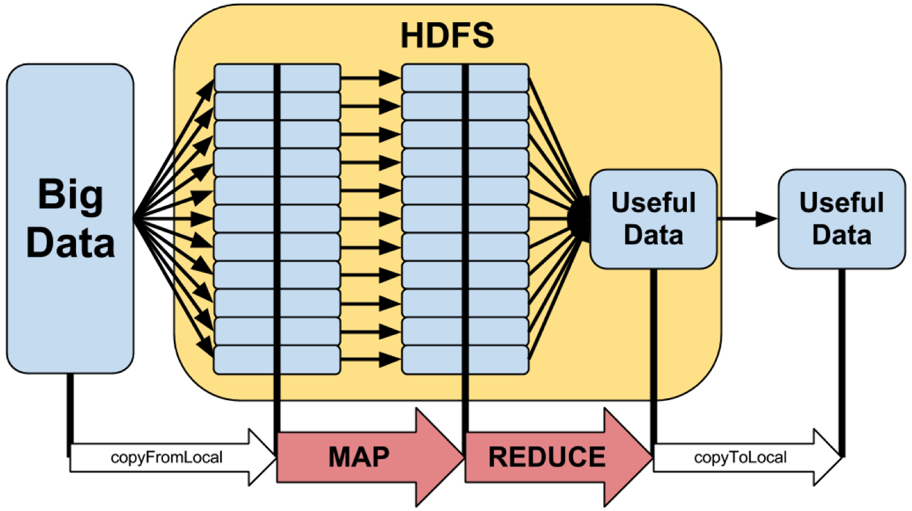

# Hadoop和Map-Reduce

## Hadoop历史

Hadoop雏形开始于2002年得Apache得Nutch，Nutch是一个开源Java实现的搜索引擎，它提供了我们运行自己的搜索引擎所需的全部工具。包括全文搜索和Web爬虫。

随后在2003年Google发表了一篇技术学术论文谷歌文件系统（GFS）。GFS就是Google File System，Google公司为了存储海量搜索数据而设计的专用文件系统。

2004年Nutch创始人Doug Cutting基于Google的GFS论文实现了分布式文件存储系统名为NDFS。

2004年Google又发表了一篇技术学术论文MapReduce。MapReduce是一种编程模型，用于大规模数据集（大于1TB）的并行分析运算。

2005年Doug Cutting又基于MapReduce，在Nutch搜索引擎上实现了该功能。

2006年，Yahoo雇佣了Doug Cutting，Doug Cutting将NDFS和MapReduce升级命名为Hadoop，Yahoo开建了一个团队给Doug Cutting专门研究发展Hadoop。

Google和Yahoo对Hadoop的贡献功不可没。

## Hadoop核心

Hadoop的核心是HDFS和MapReduce，而两者只是理论基础，不是具体可使用的高级应用，Hadoop生态又很多经典子项目，比如HBase、Hive等，这些都是基于HDFS和MapReduce发展出来的。想要了解Hadoop，就必须知道HDFS和MapReduce是什么。

## HDFS

HDFS（Hadoop Distributed File System, Hadoop分布式文件系统），它是一个高度容错性的系统，适合部署在廉价的机器上，HDFS能提供高吞吐量的数据访问，适合那些有着超大数据集（Large data set）的应用程序。

HDFS的设计特点是：

**大数据文件**，非常适合上T级别的大文件或者一堆大数据文件的存储，如果文件只有几个G甚至更小就没啥意思了。

**文件分块存储**，HDFS会将一个完整的大文件平均分块存储到不同的计算器上，它的意义在于读取文件时可以同时从多个主机取不同区块的文件，多主机读取比单主机读取效率要高得多。

**流式数据访问**，一次写入多次读写，这种模式和传统文件不同，它不支持动态改变文件内容，而是要求让文件一次写入就不做变化，要变化也只能在文件末添加内容。

**廉价硬件**，HDFS可以应用在普通PC机上，这种机制能够让一些公司用几十台廉价的计算机就可以撑起一个大数据集群。

**硬件故障**，HDFS认为所有计算机都有可能出问题，为了防止每个主机失效，读取不到该主机的块文件，它将同一个文件的块副本分配到其他某几个主机上，如果其中一台主机失效，可以迅速找另一块副本取文件。

### HDFS的关键元素

**Block**：将一个文件进行分块，通常是64M。大文件的存储会被分割为多个block进行存储。每个block会在多个datanode上存储多份副本，默认为3份（这些设置都能够通过配置文件进行更改）

**NameNode**：保存整个文件系统的目录信息、文件信息及分块信息，这是由唯一一台主机专门保存，当然如果这台主机出错，NameNode就失效了。在Hadoop2.*上开始支持activity-standy模式，如果主NameNode失效，启动备用主机运行NameNode。主要负责存储一些metadata信息，主要包括文件目录、block和文件对应关系，以及block和datanode的对应关系

**DataNode**：分布在廉价的计算机上，用于存储Block块文件。高容错性大部分在datanode上实现的（还有一部分容错性是体现在namenode和secondname，还有jobtracker的容错等）。

​                              

### hdfs设计思路

HDFS设计之初就是针对超大文件的存储的，小文件不会提高访问和存储速度，反而会降低；其次它采用了最高效的访问模式，也就是经常所说的流式数据访问，特点就是一次写入多次读取；再有就是它运行在普通的硬件之上的，即使硬件故障，也就是通过容错来保证数据的高可用。

### HDFS优点

+ 高吞吐访问：HDFS的每个block分布在不同的rack上，在用户访问时，HDFS会计算使用最近和访问量最小的服务器给用户提供。由于block在不同的rack上都有备份，所以不再是单数据访问，所以速度和效率是非常快的。另外HDFS可以并行从服务器集群中读写，增加了文件读写的访问带宽。
+ 高容错性：系统故障时不可避免的，如何做到故障之后的数据恢复和容错处理是至关重要的。HDFS通过多方面保证数据的可靠性，多份复制并且分布到物理位置不同的服务器上，数据校验功能、后台的连续自检数据一致性功能，都是为高容错提供了可能。
+ 容量扩充：因为HDFS的block信息存放到namenode上，文件的block分布在datanode上，当扩充的时候，仅仅添加datanode数量，系统可以在不停止服务的情况下做扩充，不需要人工干预。

### HDFS常见命令

```
# 显示/下的所有文件夹信息
hadoop fs -ls /

# 递归显示所有文件夹和子文件（夹）
hadoop fs -lsr

# 创建/user/hadoop目录
hadoop fs -mkdir /user/hadoop

# 把a.txt放到集群/user/hadoop/文件夹下
hadoop fs -put a.txt /user/hadoop/

# 把集群上的/user/hadoop/a.txt拉到本地/目录下
hadoop fs -get /user/hadoop/a.txt /

# 集群上复制文件
hadoop fs -cp src dst

# 集群上移动文件
hadoop fs -mv src dst

# 查看集群上文件/user/hadoop/a.txt的内容
hadoop fs -cat /user/hadoop/a.txt

# 删除集群上/user/hadoop/a.txt
hadoop fs -rm /user/hadoop/a.txt

# 删除目录和目录下所有文件
hadoop fs -rmr /user/hadoop/a.txt

# 与hadoop fs -put功能类似
hadoop fs -copyFromLocal localsrc dst

# 将本地文件上传到hdfs， 同时删除本地文件
hadoop fs -moveFromLocal localsrc dst
```


## MapReduce

通俗说MapReduce是一套从海量源数据提取分析元素最后返回结果集的编程模型，将文件分布式的存储到硬盘是第一步，而从海量数据中提取分析我们需要的内容就是MapReduce需要做的事情了。

下面以一个计算海量数据最大值为例：一个银行有上亿储户，银行希望找到存储金额最高的金额是多少，按照传统的计算方式，我们会这样：

```java
Long moneys[] …
Long max=0L;
for(int i=0;i<moneys.length;i++){
       if(moneys[i]>max){
              max = moneys[i];
       }
}
```

如果计算的数组长度少的话，这样实现是不会又问题的，但是面对海量数据的时候就会有问题。

MapReduce会这样做：首先数字是分布存储在不同块中的，以某几个块为一个map，计算出map中最大的值，然后将每个map中的最大值做Reduce操作，Reduce再取最大值给用户。


 MapReduce的基本原理就是：将大的数据分析分成小块逐个分析，最后再将提取出来的数据汇总分析，最终获得我们想要的内容，当然怎么分块分析，怎么做Reduce操作非常复杂，hadoop已经提供了数据分析的实现，我们只需要编写简单的需求命令即可达成我们想要的数据。

**总结**

总的来说，Hadoop适合用于大数据存储和大数据分析的应用，适合于服务器几千台到几万台的机群运行，我们支持PB级的存储容量

Hadoop典型应用有：搜索，日志处理，推荐系统，数据分析，视频图像分析，数据保存等。

## Hadoop经典案例：词频统计



### 总体流程

对特别大的文件统计，如果是单机完成，我们需要做的事情是维护一个计算器字典，对每次出现的词，词频+1。但是当数据量非常大的时候，没办法再内存中维护这么大的一个字典，我们就要换一种思路来完成这个任务，也就是map-reduce过程。

大体的过程画成图是下面这个样子：


分成下面几个环节：

* map阶段

  主要完成key-value对生成，这里是每看到一个单词，就输出（单词，1）的kv对

* 排序阶段

  对刚才的kv对进行排序，这里相同单词就再一块儿了

* Reduce阶段

  对同一个单词的次数进行汇总，得到（词，频次）对

### Map阶段代码

由于有了hadoop streaming，可以用python脚本完成map和reduce得过程，然后把整个流程跑起来！

比如map阶段要做得就是把每一个单词得出现1词得信息输出来！所以我们写一个mapper.py文件，具体内容如下：

```python
import sys

# 从标准输入过来得数据
for line in sys.stdin:
    # 把首位得空格去掉
    line = line.strip()
    # 把这一行文本切分成单词（按照空格）
    words = line.split()
    # 对见到得单词进行次数标注（出现1次）
    for word in words:
        print('%s\t%s' %(word, 1))
```

对于输入进来得每一行，我们做完切分之后，都会输出（单词，1）这样一个kv对，表明这个单词出现过。

### 排序阶段

中间会又一个对上述结果进行排序得过程，以保证所有相同得单词都再一起，不过不用担心，这个过程是系统会自动完成得，因此不用我们编写额外得代码。

### Redece阶段

这个阶段我们可以用一个reduce.py得python脚本来完成，具体完成得任务，就是：

对读入的（单词，1）对

* 如果这个单词还没有结束（排序后所有相同的单词都在一起了），我们就对单词的次数+1
* 如果遇到新单词了，那重新开始对新单词计数

基于上面的想法，脚本如下：

````python
from operator import itemgetter
import sys

current_word = None
current_count = 0
word = None

# 依旧是标准输入过来的数据
for line in sys.stdin:
  # 去除左右空格
  line = line.strip()
  
  # 按照tab键对行进行切分，得到word和次数1
  word, count = line.split('\t', 1)
  # 你得到的1是一个字符串，需要对它进行类型转化
  try:
    count = int(count)
  except ValueError:
    # 如果不能转成数字，输入又问题，调到下一行
    continue
  # 如果本次读取的单词和上一次一样，对次数加1
  if current_word == word:
  	current_count += count
  else:
    if current_word:
      # 输出统计结果
      print('%s\t%s' %(current_word, current_count))
    current_count = count
    current_word = word
    
  # 不要忘记最后一个词，也得输出结果
  if current_word == word:
    print('%s\t%s' %(current_word, current_count))
````

本地模拟测试代码

一般情况下，我们不会一遍遍用hadoop streaming执行任务，去测试脚本写的对不对，这个过程太麻烦了。我们可以利用linux管道模拟map-reduce的过程！比如我们可以下面这样测试：

```
# very basic test
user@ubuntu:~$ echo "foo foo quux labs foo bar quux" | /home/hduser/mapper.py
foo     1
foo     1
quux    1
labs    1
foo     1
bar     1
quux    1
user@ubuntu:~$ echo "foo foo quux labs foo bar quux" | /home/hduser/mapper.py | sort -k1,1 | /home/hduser/reducer.py
bar     1
foo     3
labs    1
quux    2
# 用一本英文电子书作为输入测试一下！比如可以在http://www.gutenberg.org/etext/20417下载到！
user@ubuntu:~$ cat /tmp/gutenberg/20417-8.txt | /home/hduser/mapper.py
 The     1
 Project 1
 Gutenberg       1
 EBook   1
 of      1
# 后面的sort和reducer过程是一样的
```

## Hadoop集群运行案例

如果通过了测试，我们就可以在集群上运行我们的案例了，我们先从下面3个链接拉取3本电子书，并下载到一个本地路径上，比如/tmp/gutenberg

```
user@ubuntu:~$ ls -l /tmp/gutenberg/
total 3604
-rw-r--r-- 1 hduser hadoop  674566 Feb  3 10:17 pg20417.txt
-rw-r--r-- 1 hduser hadoop 1573112 Feb  3 10:18 pg4300.txt
-rw-r--r-- 1 hduser hadoop 1423801 Feb  3 10:18 pg5000.txt
user@ubuntu:~$
```

#### 拷贝文件到HDFS上

根据我们前面给大家准备好的HDFS命令，执行以下命令：

```
user@ubuntu:/usr/local/hadoop$ bin/hadoop dfs -copyFromLocal /tmp/gutenberg /user/hduser/gutenberg
hduser@ubuntu:/usr/local/haddoop$ bin/hadoop dfs -ls
Found 1 items
drwxr-xr-x   - user supergroup          0 2016-05-08 17:40 /user/hduser/gutenberg
user@ubuntu:/usr/local/hadoop$ bin/hadoop dfs -ls /user/hduser/gutenberg
Found 3 items
-rw-r--r--   3 hduser supergroup     674566 2016-05-10 11:38 /user/hduser/gutenberg/pg20417.txt
-rw-r--r--   3 hduser supergroup    1573112 2016-05-10 11:38 /user/hduser/gutenberg/pg4300.txt
-rw-r--r--   3 hduser supergroup    1423801 2016-05-10 11:38 /user/hduser/gutenberg/pg5000.txt
user@ubuntu:/user/local/hadoop$
```

#### 执行map-reduce任务

用hadoop streaming执行map-reduce任务，命令行执行：

```
user@ubuntu:/usr/local/hadoop$ bin/haddop jar contrib/streaming/hadoop-*streaming*.jar\
-file /home/hduser/mapper.py	-mapper /home/hduser/mapper.py \
-file /home/hduser/reducer.py 	-reducer /home/hduser/reducer.py \
-input /user/hduser/gutenberg/* -output /user/hduser/gutenberg-output
```

你甚至可以用-D去执行reducer的个数：

```
user@ubuntu:/usr/local/hadoop$ bin/hadoop jar contrib/streaming/hadoop-*streaming*.jar -D mapred.reduce.tasks=16 ...
```

运行的结果过程输出的信息大概是下面这个样子：

```
user@ubuntu:/usr/local/hadoop$ bin/haddop jar contrib/streaming/hadoop-*streaming*.jar -mapper /home/hduser/mapper.py -reducer /home/hduser/reducer.py -input /user/hduser/gugenber/* -output /user/hduser/gutenberg-output

addtionalConfSpec_:null
null=@@@userJobConfProps_.get(stream.shipped.hadoopstreaming
 packageJobJar: [/app/hadoop/tmp/hadoop-unjar54543/]
 [] /tmp/streamjob54544.jar tmpDir=null
 [...] INFO mapred.FileInputFormat: Total input paths to process : 7
 [...] INFO streaming.StreamJob: getLocalDirs(): [/app/hadoop/tmp/mapred/local]
 [...] INFO streaming.StreamJob: Running job: job_200803031615_0021
 [...]
 [...] INFO streaming.StreamJob:  map 0%  reduce 0%
 [...] INFO streaming.StreamJob:  map 43%  reduce 0%
 [...] INFO streaming.StreamJob:  map 86%  reduce 0%
 [...] INFO streaming.StreamJob:  map 100%  reduce 0%
 [...] INFO streaming.StreamJob:  map 100%  reduce 33%
 [...] INFO streaming.StreamJob:  map 100%  reduce 70%
 [...] INFO streaming.StreamJob:  map 100%  reduce 77%
 [...] INFO streaming.StreamJob:  map 100%  reduce 100%
 [...] INFO streaming.StreamJob: Job complete: job_200803031615_0021
 [...] INFO streaming.StreamJob: Output: /user/hduser/gutenberg-output
user@ubuntu:/usr/local/hadoop$
```

#### 查看执行结果

上面的信息告诉我们任务执行成功了，结果文件存储在hdfs上的/user/hduser/gutenberg-out目录下，我们来看一下

```
user@ubuntu:/usr/local/hadoop$ bin/hadoop dfs -ls /user/hduser/gugenberg-output
Found 1 items
/user/hduser/gutenberg-output/part-00000     <r 1>   903193  2017-03-21 13:00
user@ubuntu:/usr/local/hadoop$
```

还可以直接查看结果的内容：

```
user@ubuntu:/usr/local/hadoop$ bin/hadoopo dfs -cat /user/hduser/gutenberg-output/part-00000
"(Lo)cra"       1
"1490   1
"1498," 1
"35"    1
"40,"   1
"A      2
"AS-IS".        2
"A_     1
"Absoluti       1
[...]
user@ubuntu:/usr/local/hadoop$
```

