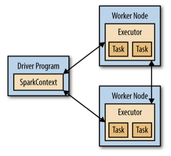

# Spark

## Spark 核心概念和操作

spark可以分为1个driver（笔记本电脑或者集群网关机器上）和若干executor在（各个节点上），通过SparkContext（简称sc）连接Spark集群、创建RDD、累加器(accumlaor)、广播变量（broadcast variable），简单可以认为SparkContext是Spark程序的根本。

Driver会把计算任务分成一系列小的task，然后送到executor执行。executor之间可以通信，在每个executor完成自己的task以后，所有的信息会被传回。



在Spark里，所有的处理和计算任务都会被组织成一系列Resilient Distributed Dataset（弹性分布式数据集，简称RDD）上的transformation（转换）和actions（动作）。

RDD是一个包含诸多元素、被划分到不同节点上进行并行处理的数据集合，可以将RDD持久化到内存中，这样就可以有效地进在并行操作中复用（在机器学习这种需要反复迭代的任务中非常有效）。在节点发生错误时RDD也可以自动恢复。

RDD就像一个numpy中的array或者Pandas中的Series，可以视作一个有序的item集合。只不过这些item并不存在driver端的内存里，而是被分割成很多partitions，每个partition的数据存在集群的executor的内存中。

RDD是最重要的载体，我们看看如何初始化这么一个对象：

### 初始化RDD方法1

如果你本地内存中已经有一份序列数据（比如python的list），你可以通过`sc.parallelize`去初始化一个RDD

当你执行这个操作以后，list中的元素将被自动分块（partitioned），并且把每一块送到集群上的不同机器上。

```python
import pyspark
from pyspark import SparkContext
from pyspark import SparkConf

conf = SparkConf().setAppName('miniProject').setMaster('local[*]')
sc = SparkContext.getOrCreate(conf)
rdd = sc.parallelize([1,2,3,4,5])
rdd
# ParallelCollectionRDD[0] at parallelize at PythonRDD.scala:475
```

查看数据分块个数

```python
rdd.getNumPartitions()
# 4
```

如果你想看看分区状况怎么办

```python
rdd.glom().collect()
# [[1], [2], [3], [4, 5]]
```

在这个例子中，是一个4个节点的Spark集群。Spark创建了4个executor，然后把数据分成4个块

**tips：使用 `sc.parallelize`，你可以把python list，Numpy array 或者 Pandas Series，Pandas DataFrame 转成Spark RDD。**

### 初始化RDD方法2

第二种方式当时是直接把文本读到RDD了

你的每一行都会被当做item，不过需要注意的一点是，Spark一般默认你的路径指向HDFS的，如果你要从本地读取文件的话，给一个file://开头的全局路径。

```python
# Record current path for future use
import os
cwd = os.getcwd()  # 获取当前路径
rdd = sc.textFile("file://"+cwd+"/names/yob1880.txt")
rdd
# Out[]:file:///home/ds/notebooks/spark/names/yob1880.txt MapPartitionsRDD[3] at textFile at NativeMethodAccessorImpl.java:-2
rdd.first()
# 显示第一个rdd中的第一个元素
```

你甚至可以很粗暴的读入整个文件夹的所有文件。

但是要特别注意，这种读法，**RDD中的每个item实际上是一个形如（文件名，文件所有内容）的元组。**

```python
rdd = sc.wholeTextFiles('file://' + cwd + 'names')
rdd
# out[]: org.apache.spark.api.java.JavaPairRDD@6b954745
rdd.first()
# out[]:(u'file:/home/ds/notebooks/spark/names/yob1880.txt', u'Mary,F,70...')
```

### 其余初始化RDD的方法

RDD还可以通过其他的方式初始化，包括

+ HDFS上的文件
+ Hive中的数据库与表
+ Spark SQL得到的结果

### RDD transformation 的那些事

大家还对python的list comprehension有印象吗，RDD可以进行一系列的变换得到新的RDD，有点类型那个过程，我们先给大家提一下RDD上最常用的transformation：

* `map() ` 对RDD的每一个item都执行同一个操作
* `flatMap()` 对RDD中的item执行统一操作以后得到一个list，然后以平铺的方式把这些list里所有的结果组成新的list
* `filter() `筛选出来满足条件的item
* `distinct()` 对RDD中的item去重
* `sample()` 从RDD中的item中采样一部分出来，有放回或者无放回
* `sortBy()` 对RDD中的item进行排序

**如果你想到操作后的结果，可以用一个叫做`collect()`的action把所有的item转换成一个Python list。**

简单的例子如下：

```python
numbersRDD = sc.parallelize(range(1,10+1))
print(numbersRDD.collect())
# [1, 2, 3, 4, 5, 6, 7, 8, 9, 10]
squaresRDD = numbersRDD.map(lambda x:x**2)
# [1, 4, 9, 16, 25, 36, 49, 64, 81, 100]
filteredRDD = numbersRDD.filter(lambda x:x%2==0)
# [2, 4, 6, 8, 10]
```

然后咱们看看`flatMap()`的平展功能：

```python
sentencesRDD = sc.parallelize(['Hello word', 'My name is Patrick'])
wordsRDD = sentencesRDD.flatMap(lambda sentence: sentence.split(' '))
print(wordsRDD.collect())
# ['Hello', 'world', 'My', 'name', 'is', 'Patrick']
print(wordsRDD.count())
# 6
```

为了做一个小小的对应，咱们看看python里对应的操作大概是什么样的：

```python
l=['Hello World', 'My name is Patrick']
ll = []
for sentence in l:
    ll = ll + sentence.split(' ')
print(ll)
# ['Hello', 'world', 'My', 'name', 'is', 'Patrick']
```

比较酷炫的是，前面提到的Transformation， 可以一个接一个的串联，比如：

```python
def doubleIfOdd(x):
    if x % 2 ==1:
        return 2 * x
    else:
        return x
resultRDD = (numberRDD  # [1, 2, 3, 4, 5, 6, 7, 8, 9, 10]
            .map(doubleIfOdd)  # [2, 2, 6, 4, 10, 6, 14, 8, 18, 10]
            .filter(lambda x : x > 6) # [10, 14, 8, 18 ,10]
            .distinct())
resultRDD.collect()
# [8, 10, 18, 14]
```

### RDD间的操作

如果你手头上有两个RDD了，下面的这些操作能够帮你对他们以各种方式组合得到1个RDD：

* `rdd1.union(rdd2)` ：所有rdd1和rdd2中的item组合
* `rdd1.intersection(rdd2)`：rdd1和rdd2的交集
* `rdd1.substract(rdd2)`：所有在rdd1中但不在rdd2中的item（差集）
* `rdd1.cartesian(rdd2)`：rdd1和rdd2中所有的元素笛卡尔乘机

简单的例子如下：

```python
numbersRDD = sc.parallelize([1,2,3])
moreNumberRDD = sc.parallelize([2,3,4])
print(numbersRDD.union(moreNumberRDD).collect()) # 并集
# [1, 2, 3, 2, 3, 4]
numbersRDD.intersection(moreNumberRDD).collect() # 交集
# [2, 3]
numbersRDD.subtract(moreNumberRDD).collect() # 差集
# [1]
numbersRDD.cartesian(moreNumbersRDD).collect() # 笛卡尔积
# [(1, 2), (1, 3), (1, 4), (2, 2), (2, 3), (2, 4), (3, 2), (3, 3), (3, 4)]
```

特别注意：Spark的一个核心概念是**惰性计算**。当你把一个RDD转换成另一个的时候，这个转换不会立刻生效执行！！！Spark慧把它先记在心里，等到真的需要拿到转换结果的时候，才会重新组织你的transformations（因为可能有一连串的变换）这样可以避免不必要的中间结果存储和通信。

刚才提到了**惰性计算**，那么什么东西能让它真的执行转换和计算呢？是的，就是我们马上提到的Actions， 下面是常见action，当他们出现的时候，表明我们需要执行刚才定义的transformations了：

+ collect() ：计算所有的items并返回所有的结果到driver端，接着collect()会以python list的形式返回结果
+ first()：和上面的类似，不过只返回第一个item
+ tack(n)：类似，但是返回n个item
+ count()：计算RDD中item的个数
+ top(n)：返回头n个items，按照自然结果排序
+ reduce()：对RDD中的item做聚合

我们之前已经看到collect(),first()和count()的例子了， 俺们看看reduce()如何使用。比如Spark里从1到10你可以这么做。

```python
rdd = sc.parallelize(range(1,10+1))
rdd.reduce(lambda x,y : x+y)
# 55
```

如果你想理解一下reduce的细节的话，其实可能会先在每个分区（partition）里完成reduce操作，然后全局的进行reduce。这个过程你可以从如下代码大致理解

```python
def f(x,y):
    return x+y:
l = [1,2,3,4]
f(f(f(l[0],l[1]),l[2]),l[3])  # 10
```

有一个很有用的操作，我们试想一下，有时候我们需要重复用到某个transformation序列得到的RDD结果。但是一遍遍重复计算显然是要开销的，所以我们可以通过一个叫做`cache()`的操作把它暂时存储在内存中：

```python
# Caluculate the average of all the squares from 1 to 10
import numpy as np
numbersRDD = sc.parallelize(np.linspace(1.0, 10.0, 10))
squaresRDD = numbersRDD.map(lambda x : x**2)

squaresRDD.cache()  # Preserve the actual items of this RDD in memory
avg = squaresRDD.reduce(lambda x,y:x+y)/squaresRDD.count()

# 38.5
```

缓存RDD结果对于重复迭代的操作非常有用，比如很多机器学习的算法，训练过程需要重复迭代。

#### 练习作业
**我们知道牛顿法求$\sqrt{n}$(达到eps准确度)的算法是这样的：**
* **给定一个初始值 $x = 1.0$.**
* **求$x$和$n / x$的平均$(x + n/x)/2$**
* **根据$(x + n/x)/2$和$\sqrt{n}$的大小比较，确定下一步迭代的2个端点，同时不断迭代直至$x*x$与$n$之间的差值小于$eps$.**

**在Spark中完成上述算法**  
```python
rdd = sc.parallelize([2])
x = 1.0
while abs(x**2-2)>1e-9:
    x = rdd.map(lambda n: (n, (x+n/x)/2)).first()[1]
print(x)
# 1.4142135623746899
```

### 针对更复杂结构的transformation和action

咱们刚才已经见识了Spark中最常见的transformation和action，但是有时候我们会遇到更复杂的结构，比如非常经典的是以元组形式组成的k-v对（key，value），我们把它叫做pair RDDs，而Spark中针对这种item结构的数据，定义了一些transformation和action：

* `reduceByKey()`：对所有有着相同key的items执行reduce操作
* `groupByKey()`：返回类似`（key，listOfValues）`元组的RDD，后面的value list是同一个key下面的
* `sortByKey()`：按照key排序
* `countByKey()`：按照key去对item个数进行统计
* `collectAsMap()`：和collect有些类似，但是返回的是k-v字典

```python
rdd = sc.parallelize(["Hello hello", "Hello New York", "York says hello"])
resultRDD = (
    rdd
    .flatMap(lambda sentence:sentence.split(' '))  # split into words
    .map(lambda word:word.lower())  # lowercase
    .map(lambda word:(word, 1))   # count each appearance
    .reduceByKey(lambda x,y:x+y)  # add counts for each word
)
resultRDD.collect()
# [('says', 1), ('new', 1), ('hello', 4), ('york', 2)]
```

我们可以将结果以k-v字典的形式返回

```python
result = resultRDD.collectAsMap()
print(result)
# {'hello': 4, 'new': 1, 'says': 1, 'york': 2}

resultRDD.sortBy(keyfunc=lambda (word, count):count, ascending=False).take(2)
# 统计出现频次最高的2个词
# out[]: [('hello', 4), ('york', 2)]
```

还有一个很有意思的操作时，在给定2个RDD后，我们可以通过一个类似SQL的方式去join他们。

```python
# Home of different people
homesRDD = sc.parallelize([
        ('Brussels', 'John'),
        ('Brussels', 'Jack'),
        ('Leuven', 'Jane'),
        ('Antwerp', 'Jill'),
    ])

# Quality of life index for various cities
lifeQualityRDD = sc.parallelize([
        ('Brussels', 10),
        ('Antwerp', 7),
        ('RestOfFlanders', 5),
    ])
homesRDD.join(lifeQualityRDD).collect()
# [('Antwerp', ('Jill', 7)),
#  ('Brussels', ('John', 10)),
#  ('Brussels', ('Jack', 10))]
```

## Spark SQL&DataFrame

Spark SQL 是Spark处理数据结构化数据的一个模块，与基础的SparkRDD API不同，SparkSQL提供查询结构化数据及计算结果等信息的结构。在内部，SparkSQL使用这个额外的信息去执行额外的优化，有几种方式进行交互，包括SQL和Dataset API。当使用相同执行引擎进行计算时，无论使用哪种API 语言都可以快速的计算。

**SQL**

Spark SQL的功能之一就是执行SQL查询，Spark SQL也能够被用于从已存在的Hive环境中读取数据。当以另外的编程语言运行SQL时，查询结构将以Dataset/DataFrame的形式返回，也可以使用命令行或者通过JDBC/ODBC与SQL接口交互。

**DataFrames**

从RDD里可以生成类似大家在pandas中的DataFrame，同时可以方便地在上面完成各种操作。

### 构建SparkSession

Spark SQL中所有功能的入口点时SparkSession类。要创建一个SparkSession，仅使用SparkSession.buider()就可以了：

```python
from pyspark.sql import SparkSession
spark = (
    SparkSession
    .builder
    .appName('python spark sql')
    .config('spark.some.config.option','some-value')
    .getOrCreate()
)
```

### 创建DataFrames

在一个SparkSession中，应用程序可以从一个已经存在的RDD或者hive表，或者从Spark数据源中创建一个DataFrame。

举个例子，下面就是基于一个json文件创建一个DataFrame：

```python
df = spark.read.json('data/people.json')
df.show()
# +----+-------+
# | age|   name|
# +----+-------+
# |null|Michael|
# |  30|   Andy|
# |  19| Justin|
# +----+-------+
```

### DataFrame操作

DataFrames 提供一个特定的语法用在Scala，java，Python and R中机构化数据的操作。

在Python中，可以通过`df.age`或者`df['age']`来获取DataFrame的列。虽然前者便于交互式操作，但是还是建议使用后者，这样不会破坏列名，也能引用DataFrame的类

#### select 操作

```python
df.printSchema()  # 相当于df.info()
df.select('name').show()  # 选择单列
# +-------+
# |   name|
# +-------+
# |Michael|
# |   Andy|
# | Justin|
# +-------+
df.select(['name','age']).show()  # 选择多列
# +-------+----+
# |   name| age|
# +-------+----+
# |Michael|null|
# |   Andy|  30|
# | Justin|  19|
# +-------+----+
df.select(df['name'], df['age']+1).show()
# +-------+---------+
# |   name|(age + 1)|
# +-------+---------+
# |Michael|     null|
# |   Andy|       31|
# | Justin|       20|
# +-------+---------+
```

#### filter操作

```python
df.filter(df['age']>21).show()
#+---+----+
#|age|name|
#+---+----+
#| 30|Andy|
#+---+----+
df.groupBy('age').count().show()
#+----+-----+
#| age|count|
#+----+-----+
#|  19|    1|
#|null|    1|
#|  30|    1|
#+----+-----+
```

### Spark SQL

SparkSession的sql函数可以让应用程序以编程的方式运行SQL查询，并将结果作为一个DataFrame返回。

```python
df.createOrReplaceTempView('people')
sqlDF = spark.sql('SELECT * FROM people')
sqlDF.show()
#+----+-------+
#| age|   name|
#+----+-------+
#|null|Michael|
#|  30|   Andy|
#|  19| Justin|
#+----+-------+
```

### Spark DataFrame于RDD交互

Spark SQL支持两种不同的方法用于转换以存在的RDD成为Dataset

第一种方式是使用反射去推断一个包含指定的对象类型的RDD的Schema。在你的Spark应用程序中，当你一直Schema时这个机遇方法的反射可以让你的代码更简洁。

第二种用于创建Dataset的方法是通过一个允许你构造一个Schema然后把它应用到一个已存在的RDD的编程接口。然而这种方法更繁琐，当列和他们的类型知道运行时都是未知时它允许你去构造Dataset

**反射推断**

```python
from pyspark.sql import Row
sc = spark.sparkContext
lines = sc.textFile('data/people.txt')
parts = lines.map(lambda l:l.split(',')) # rdd
people = parts.map(lambda p:Row(name=p[0], age=int(p[1])))

# Infer the schema, and register the DataFrame as a table
schemaPeople = spark.createDataFrame(people) # df
schemaPeople.createOrReplaceTempView('people')  # schema

teenagers = spark.sql("SELECT name FROM people WHERE age >= 13 AND age <= 19")
type(teenagers)  # pyspark.sql.dataframe.DataFrame
type(teenagers.rdd)  # pyspark.rdd.RDD
teenagers.rdd.first()  # Row(name='Justin')

teenNames = teenagers.rdd.map(lambda p: "Name: " + p.name).collect()
for name in teenNames:
    print(name)
# Name: Justin
```

**以编程的方式指定Schema**

也可以通过以下的方式去初始化一个`DataFrame`。

+ RDD从原始的RDD创建一个RDD的`tuples`或者一个列表；
+ Step1被创建后，创建schema表示一个`StructType`匹配RDD中的结构。
+ 通过`SparkSession`提供的`createDataFrame`方法应用`Schema`到RDD。

```python
from pyspark.sql.types import *
sc = spark.sparkContext

# Load a text file and convert each line to a Row.
lines = sc.textFile('data/people.txt')
parts = lines.map(lambda l:l.split(','))
# Each line is converted to a tuple.
people = parts.map(lambda p:(p[0],p[1].strip()))

# The schema is encoded in a string.
schemaString = 'name age'
fields = [StructField(field_name, StringType(), True) for field_name in schemaString.split()]
schema = StructType(fields)

# Apply the schema to the RDD.
schemaPeople = spark.createDataFrame(people, schema)

schemaPeople.createOrReplaceTempView('people')
result = spark.sql('SELECT name FROM people')
result.show()
# +-------+
# |   name|
# +-------+
# |Michael|
# |   Andy|
# | Justin|
# +-------+
```

## Spark DataFrame SQL 实例

### 初始化Spark Session

```python
from pyspark.sql import SparkSession

spark = (
    SparkSession
    .builder
    .appName('python spark sql')
    .config('spark.some.config.option','some-value')
    .getOrCreate()
)
```

### 构建数据集和序列化

```python
stringJSONRDD = spark.sparkContext.parallelize((""" 
  { "id": "123",
    "name": "Katie",
    "age": 19,
    "eyeColor": "brown"
  }""",
   """{
    "id": "234",
    "name": "Michael",
    "age": 22,
    "eyeColor": "green"
  }""", 
  """{
    "id": "345",
    "name": "Simone",
    "age": 23,
    "eyeColor": "blue"
  }""")
)
# 构建DataFrame
swimmersJSON = spark.read.json(stringJSONRDD)
# 创建临时表
swimmersJSON.createOrReplaceTempView('swimmersJSON')
# DataFrame 信息
swimmersJSON.show()
# +---+--------+---+-------+
# |age|eyeColor| id|   name|
# +---+--------+---+-------+
# | 19|   brown|123|  Katie|
# | 22|   green|234|Michael|
# | 23|    blue|345| Simone|
# +---+--------+---+-------+

# 执行SQL请求
spark.sql('select * from swimmersJSON').collect()
# [Row(age=19, eyeColor='brown', id='123', name='Katie'),
#  Row(age=22, eyeColor='green', id='234', name='Michael'),
#  Row(age=23, eyeColor='blue', id='345', name='Simone')]

# 输出数据表的格式
swimmersJSON.printSchema()
# root
#  |-- age: long (nullable = true)
#  |-- eyeColor: string (nullable = true)
#  |-- id: string (nullable = true)
#  |-- name: string (nullable = true)

# 执行SQL
spark.sql('select count(1) from swimmersJSON')  
# out[]: DataFrame[count(1): bigint]
spark.sql('select count(1) from swimmersJSON').show()
# +--------+
# |count(1)|
# +--------+
# |       3|
# +--------+
```

### DataFrame的请求方式 vs SQL的写法

```python
# DataFrame 的写法
swimmersJSON.select('id','age').filter('age=2').show()
# +---+---+
# | id|age|
# +---+---+
# |234| 22|
# +---+---+

# SQL的写法
spark.sql('select id, age from swimmersJSON where age=22').show()
# +---+---+
# | id|age|
# +---+---+
# |234| 22|
# +---+---+

# DataFrame的写法
swimmersJSON.select('name','eyeColor').filter('eyeColor like "b%"').show()
# +------+--------+
# |  name|eyeColor|
# +------+--------+
# | Katie|   brown|
# |Simone|    blue|
# +------+--------+

# SQL的写法
spark.sql('select name, eyeColor from swimmersJson where eyeColor like "b%"').show()
# +------+--------+
# |  name|eyeColor|
# +------+--------+
# | Katie|   brown|
# |Simone|    blue|
# +------+--------+
```

## Spark 特征工程

### 对连续值得处理

#### 1.Binarizer / 二值化

```python
from spspark.sql import SparkSession
from pyspark.ml.feature import Binarizer

spark = SparkSession.buider.appName('BinarizerExample').getOrCreate()
continuousDataFram = spark.createDataFrame([
    (0, 1.1),
    (1, 8.5),
    (2, 5.2)
], ['id', 'feature'])
binarizer = Binarizer(threshold=5.1, inputCol='feature', outputcol='binarized_feature')
binarizedDataFrame = binarizer.transform(continuousDataframe)
print('Binarizer output with Threshold = %f' % binarizer.getThreshold())
binarizedDataFrame.show()
spark.stop()
```

输出结果为：

```
Binarizer output with Threshold = 5.100000
+---+-------+-----------------+
| id|feature|binarized_feature|
+---+-------+-----------------+
|  0|    1.1|              0.0|
|  1|    8.5|              1.0|
|  2|    5.2|              1.0|
+---+-------+-----------------+
```

#### 2.按照给定边界离散化

```python
from pyspark.sql import SparkSession
from pyspark.ml.feature import Bucketizer

spark = SparkSession.builder.appName('BucketizerExample').getOrCreate()

splits = [-float('inf'), -0.5, 0.0, 0.5, float('inf')]
data = [(-999.9,), (-0.5,), (-0.3,), (0.0,), (0.2,), (999.9,)]
dataFrame = spark.createDataFrame(data, ['features'])

bucketizer = Bucketizer(splits=split, inputCol='features', outputCol='bucketedFeatures')

# 按照给定的边界进行分桶
bucketedData = bucketizer.transform(dataFrame)

print('Bucketizer output with %d buckets' % (len(bucketizer.getSplits())-1))
bucketedData.show()
spark.stop()
```

输出结果：

```
Bucketizer output with 4 buckets
+--------+----------------+
|features|bucketedFeatures|
+--------+----------------+
|  -999.9|             0.0|
|    -0.5|             1.0|
|    -0.3|             1.0|
|     0.0|             2.0|
|     0.2|             2.0|
|   999.9|             3.0|
+--------+----------------+
```

#### 3.quantile discretizer / 按分位数离散化

```python
from pyspark.ml.feature import QuantileDiscretizer
from pyspark.sql import SparkSession

spark = SparkSession.builder.appName('QuantileDiscretizer').getOrCreate()

data = [(0, 18.0), (1, 19.0), (2, 8.0), (3, 5.0), (4, 2.2), (5, 9.2), (6, 14.4)]
df = spark.createDataFrame(data, ['id', 'hour'])
df = df.repartition(1)  # 分位数之前要先将数据合并到一处

# 分成3个桶进行离散化
discretizer = QuantileDiscretizer(numBuckets=3, inputCol='hour', outputCol='result')

result = discretizer.fit(df).transform(df)
result.show()
spark.stop()
```

输出结果：

```
+---+----+------+
| id|hour|result|
+---+----+------+
|  0|18.0|   2.0|
|  1|19.0|   2.0|
|  2| 8.0|   1.0|
|  3| 5.0|   0.0|
|  4| 2.2|   0.0|
|  5| 9.2|   1.0|
|  6|14.4|   2.0|
+---+----+------+
```

#### 4.最大最小值幅度缩放

```python
from pyspark.ml.feature import MaxAbsScaler
from pyspark.ml.linalg import Vectors
from pyspark.sql import SparkSession

spark = SparkSession.builder.appName('MaxAbsScalerExample').getOrCreate()
dataFrame = spark.createDataFrame([
    (0, Vectors.dense([1.0, 0.1, -8.0]),),
    (1, Vectors.dense([2.0, 1.0, -4.0]),),
    (2, Vectors.dense([4.0, 10.0, 8.0]),)
], ['id', 'features'])

scaler = MaxAbsScaler(inputCol='features', outputCol='scaledFeatures')

# 计算最大最小值用于缩放
scalerModel = scalerModel.transform(dataFrame)

# 缩放幅度在[-1,1]之间
scaledData = scalerModel.transform(dataFrame)
scalerData.select('features', 'scaledFeatures').show()
spark.stop()
```

输出结果：

```
+--------------+----------------+
|      features|  scaledFeatures|
+--------------+----------------+
|[1.0,0.1,-8.0]|[0.25,0.01,-1.0]|
|[2.0,1.0,-4.0]|  [0.5,0.1,-0.5]|
|[4.0,10.0,8.0]|   [1.0,1.0,1.0]|
+--------------+----------------+
```

#### 5.标准化

```python
from pyspark.ml.feature import StandardScaler
from pyspark.sql import SparkSession

spark = SparkSession.builder.appName('StandardScalerExample').getOrCreate()
dataFrame = spark.read.format('libsvm').load('data/mllib/sample_libsvm_data.txt')
scaler = StandardScaler(
    inputCol='features', outputCol='scaledFeatures', withStd=True, withMean=False
)

# 计算均值方差等参数
scalerModel = scaler.fit(dataFrame)

# 标准化
scaledData = scalerModel.transform(dataFrame)
scaledData.show()

spark.stop()
```

输出结果：

```
+-----+--------------------+--------------------+
|label|            features|      scaledFeatures|
+-----+--------------------+--------------------+
|  0.0|(692,[127,128,129...|(692,[127,128,129...|
|  1.0|(692,[158,159,160...|(692,[158,159,160...|
|  1.0|(692,[124,125,126...|(692,[124,125,126...|
|  1.0|(692,[152,153,154...|(692,[152,153,154...|
|  1.0|(692,[151,152,153...|(692,[151,152,153...|
|  0.0|(692,[129,130,131...|(692,[129,130,131...|
|  1.0|(692,[158,159,160...|(692,[158,159,160...|
|  1.0|(692,[99,100,101,...|(692,[99,100,101,...|
|  0.0|(692,[154,155,156...|(692,[154,155,156...|
|  0.0|(692,[127,128,129...|(692,[127,128,129...|
|  1.0|(692,[154,155,156...|(692,[154,155,156...|
|  0.0|(692,[153,154,155...|(692,[153,154,155...|
|  0.0|(692,[151,152,153...|(692,[151,152,153...|
|  1.0|(692,[129,130,131...|(692,[129,130,131...|
|  0.0|(692,[154,155,156...|(692,[154,155,156...|
|  1.0|(692,[150,151,152...|(692,[150,151,152...|
|  0.0|(692,[124,125,126...|(692,[124,125,126...|
|  0.0|(692,[152,153,154...|(692,[152,153,154...|
|  1.0|(692,[97,98,99,12...|(692,[97,98,99,12...|
|  1.0|(692,[124,125,126...|(692,[124,125,126...|
+-----+--------------------+--------------------+
only showing top 20 rows
```

还要一个模板

```python
from pyspark.ml.feature import StandardScaler
from pyspark.sql import SparkSession
spark = SparkSession.builder.appName('StandardScalerExample').getOrCreate()
dataFrame = spark.createDataFrame([
    (0, Vectors.dense([1.0, 0.1, -8.0]),),
    (1, Vectors.dense([2.0, 1.0, -4.0]),),
    (2, Vectors.dense([4.0, 10.0, 8.0]),)
], ["id", "features"])

# 计算均值方差等参数
scalerModel = scaler.fit(dataFrame)
# 标准化
scaledData = scalerModel.tranform(dataFrame)
scaled.show()
spark.stop()
```

输出结果：

```
+---+--------------+--------------------+
| id|      features|      scaledFeatures|
+---+--------------+--------------------+
|  0|[1.0,0.1,-8.0]|[0.65465367070797...|
|  1|[2.0,1.0,-4.0]|[1.30930734141595...|
|  2|[4.0,10.0,8.0]|[2.61861468283190...|
+---+--------------+--------------------+
```

#### 6.添加多项式特征

```python
from pyspark.ml.feature import PolynomialExpansion
from pyspark.ml.linalg import Vectors
from pyspark,sql import SparkSession

spark = SparkSession.builder.appName('PolynomialExpansionExample').getOrCreate()
df = spark.createDataFrame([
    (Vectors.dense([2.0, 1.0]),),
    (Vectors.dense([0.0, 0.0]),),
    (Vectors.dense([3.0, -1.0]),)
], ['features'])

polyExpansion = PolynomialExpansion(degree=3, inputCol='features', outputCol='polyFeatures')
polyDF = polyExpansion.transform(df)
polyDF.show(truncate=False)
spark.stop()
```

输出结果：

```
+----------+------------------------------------------+
|features  |polyFeatures                              |
+----------+------------------------------------------+
|[2.0,1.0] |[2.0,4.0,8.0,1.0,2.0,4.0,1.0,2.0,1.0]     |
|[0.0,0.0] |[0.0,0.0,0.0,0.0,0.0,0.0,0.0,0.0,0.0]     |
|[3.0,-1.0]|[3.0,9.0,27.0,-1.0,-3.0,-9.0,1.0,3.0,-1.0]|
+----------+------------------------------------------+
```

### 对离散型特征处理

#### 独热向量编码

```python
from pyspark.ml.feature import OneHotEncoder, StringIndexer
from pyspark.sql import SparkSession

spark = SparkSession.builder.appName('OneHotEncoderExample').getOrCreate()
df = spark.createDataFrame([
    (0, "a"),
    (1, "b"),
    (2, "c"),
    (3, "a"),
    (4, "a"),
    (5, "c")
], ['id', 'category'])
stringIndexer = StringIndexer(inputCol='category', outputCol='categoryIndex')
model = stringIndexer.fit(df)
indexed = model.tranform(df)

encoder = OneHotEncoder(inputCol='categoryIndex', outputCol='categoryVec')
encoded = encoder.transform(indexed)
encoder.show()
spark.stop()
```

输出结果：

```
+---+--------+-------------+-------------+
| id|category|categoryIndex|  categoryVec|
+---+--------+-------------+-------------+
|  0|       a|          0.0|(2,[0],[1.0])|
|  1|       b|          2.0|    (2,[],[])|
|  2|       c|          1.0|(2,[1],[1.0])|
|  3|       a|          0.0|(2,[0],[1.0])|
|  4|       a|          0.0|(2,[0],[1.0])|
|  5|       c|          1.0|(2,[1],[1.0])|
+---+--------+-------------+-------------+
```

### 对文本型处理

#### 1. 去停用词

```python
from pyspark.ml.feature import StopWordRemover
from pyspark.sql import SparkSession

spark = SparkSession.bulder.appName('StopWordRemoverExample').getOrCreate()

sentenceData = spark.createDataFrame([
    (0, ["I", "saw", "the", "red", "balloon"]),
    (1, ["Mary", "had", "a", "little", "lamb"])
],['id', 'ral'])

remover = StopWordRemover(inputCol='raw', outputCol='filtered')
remover.transform(sentenceData).show(truncate=False)
spark.stop
```

输出结果：

```
+---+----------------------------+--------------------+
|id |raw                         |filtered            |
+---+----------------------------+--------------------+
|0  |[I, saw, the, red, balloon] |[saw, red, balloon] |
|1  |[Mary, had, a, little, lamb]|[Mary, little, lamb]|
+---+----------------------------+--------------------+
```

#### 2.Tokenizer

```python
from pyspark.ml.feature import Tokenizer, RegexTokenizer
# A tokenizer that converts the input string to lowercase and then splits it by white spaces.
from pyspark.sql.functions import col, udf
from pyspark.sql.types import IntegerType
from pyspark.sql import SparkSession

spark = SparkSession.builder.appName('TokenizerExample').getOrCreate()
sentenceDataFrame = spark.createDataFrame([
    (0, "Hi I heard about Spark"),
    (1, "I wish Java could use case classes"),
    (2, "Logistic,regression,models,are,neat")
], ['id', 'sentence'])
tokenizer = Tokenizer(inputCol='sentence', outputCol='words')  # 将sentence转为为list类型
# 通过正则表达式筛选
regexTokenizer = RegexTokenizer(inputCol='sentence', outputCol='words', pattern='\\W')
countTokens = udf(lambda words:len(words), IntegerType())  # udf 自定义函数，并定义返回类型

tokenized = tokenizer.transform(sentenceDataFrame)
tokenized.select('sentence','words').withColumn(
    'tokens',
    countTokens(col('words'))
).show(truncate=False)

regexTokenized = regexTokenizer.transform(sentenceDataFrame)
regexTokenized.select('sentence','words').withColumn(
    'tokens', countTokens(col('words'))
).show(truncate=False)

spark.stop()
```

输出结果：

```
+-----------------------------------+------------------------------------------+------+
|sentence                           |words                                     |tokens|
+-----------------------------------+------------------------------------------+------+
|Hi I heard about Spark             |[hi, i, heard, about, spark]              |5     |
|I wish Java could use case classes |[i, wish, java, could, use, case, classes]|7     |
|Logistic,regression,models,are,neat|[logistic,regression,models,are,neat]     |1     |
+-----------------------------------+------------------------------------------+------+

+-----------------------------------+------------------------------------------+------+
|sentence                           |words                                     |tokens|
+-----------------------------------+------------------------------------------+------+
|Hi I heard about Spark             |[hi, i, heard, about, spark]              |5     |
|I wish Java could use case classes |[i, wish, java, could, use, case, classes]|7     |
|Logistic,regression,models,are,neat|[logistic, regression, models, are, neat] |5     |
+-----------------------------------+------------------------------------------+------+
```

#### 3.count vectorizer 词频 统计

```python
from pyspark.sql import SparkSession
from pyspark.ml.feature import CountVectorizer

spark = SparkSession.builder.appName('CountVectorizerExample').getOrCreate()

df = spark.createDataFrame([
    (0, "a b c".split(" ")),
    (1, "a b b c a".split(" "))
], ['id', 'words'])

cv = CountVectorizer(inputCol='words', outputCol='features', vocabSize=3, minDF=2.0)
model = cv.fit(df)
result = model.transform(df)
result.show(truncate=False)
spark.stop()
```

输出结果：

```
+---+---------------+-------------------------+
|id |words          |features                 |
+---+---------------+-------------------------+
|0  |[a, b, c]      |(3,[0,1,2],[1.0,1.0,1.0])|
|1  |[a, b, b, c, a]|(3,[0,1,2],[2.0,2.0,1.0])|
+---+---------------+-------------------------+
```

#### 4.TF-IDF权重

在Spark ML库中，TF-IDF被分成两部分：TF (+hashing) 和 IDF。

**TF**: HashingTF 是一个Transformer，在文本处理中，接收词条的集合然后把这些集合转化成固定长度的特征向量。这个算法在哈希的同时会统计各个词条的词频。

**IDF**: IDF是一个Estimator，在一个数据集上应用它的fit（）方法，产生一个IDFModel。 该IDFModel 接收特征向量（由HashingTF产生），然后计算每一个词在文档中出现的频次。IDF会减少那些在语料库中出现频率较高的词的权重。

```python
from pyspark.ml.feature import HashingTF, IDF, Tokenizer
from pyspark.sql import SparkSession

spark = SparkSession.builder.appName('TfIdfExample').getOrCreate()
sentenceData = spark.createDataFrame([
    (0.0, "Hi I heard about Spark"),
    (0.0, "I wish Java could use case classes"),
    (1.0, "Logistic regression models are neat")
], ["label", "sentence"])
tokenizer = Tokenizer(inputCol='sentence', outputCol='words')
wordsData = tokenizer.transform(sentenceData)

hashingTF = HashingTF(inputCol='words', outputCol='rawFeatures', numFeatures=20)
featurizedData = hashingTF.transform(wordsData)

idf = IDF(inputCol='rawFeatures', outputCol='features')
idfModel = idf.fit(featurizedData)
rescaledData = idfModel.transform(featurizedData)

rescaledData.select('label', 'features').show()
spark.stop()
```

输出结果：

```
+-----+--------------------+
|label|            features|
+-----+--------------------+
|  0.0|(20,[0,5,9,17],[0...|
|  0.0|(20,[2,7,9,13,15]...|
|  1.0|(20,[4,6,13,15,18...|
+-----+--------------------+
```

#### 5.n-gram 语言模型

```python
from pyspark.ml.feature import NGram
from pyspark.sql import SparkSession

spark = SparkSession.builder.appName('NGramExaple').getOrCreate()
wordDataFrame = spark.createDataFrame([
    (0, ["Hi", "I", "heard", "about", "Spark"]),
    (1, ["I", "wish", "Java", "could", "use", "case", "classes"]),
    (2, ["Logistic", "regression", "models", "are", "neat"])
], ["id", "words"])

ngram = NGram(n=2, inputCol='words', outputCol='ngrams')

ngramDataFrame = ngram.transform(wordDataFrame)
ngramDataFrame.select('ngrams').show(truncate=False)
spark.stop()
```

输出结果：

```
+------------------------------------------------------------------+
|ngrams                                                            |
+------------------------------------------------------------------+
|[Hi I, I heard, heard about, about Spark]                         |
|[I wish, wish Java, Java could, could use, use case, case classes]|
|[Logistic regression, regression models, models are, are neat]    |
+------------------------------------------------------------------+
```

### 高级变换

#### 1.SQL变换

```python
from pyspark.ml.feature import SQLTransformer
from pyspark.sql import SparkSession

spark = SparkSession.builder.appName('SQLTransformerExample').getOrCreate()
df = spark.createDataFrame([
    (0, 1.0, 3.0),
    (2, 2,0, 5,0)
], ['id', 'v1', 'v2'])

sqlTrans = SQLTranformer(
    statement='SELECT *, (v1+v2) AS v3, (v1*v2) AS v4 FROM __THIS__'
)
sqlTrans.transform(df).show()
spark.stop()
```

输出结果：

```
+---+---+---+---+----+
| id| v1| v2| v3|  v4|
+---+---+---+---+----+
|  0|1.0|3.0|4.0| 3.0|
|  2|2.0|5.0|7.0|10.0|
+---+---+---+---+----+
```

#### 2. R公式变换

```python
from pyspark.ml.feature import RFormula
from pyspark.sql import SparkSession

spark = SparkSession.builder.appName('RFormulaExample').getOrCreate()
dataset = spark.createDataFrame(
    [(7, "US", 18, 1.0),
     (8, "CA", 12, 0.0),
     (9, "NZ", 15, 0.0)],
    ["id", "country", "hour", "clicked"])

formula = RFormula(
    formula = 'clicked ~ country + hour',
    featuresCol = 'features',
    labelCol = 'label'
)

output = formula.fit(dataset).transform(dataset)
output.select('features', 'label').show()
spark.stop()
```

输出结果：

```
--------------+-----+
|      features|label|
+--------------+-----+
|[0.0,0.0,18.0]|  1.0|
|[0.0,1.0,12.0]|  0.0|
|[1.0,0.0,15.0]|  0.0|
+--------------+-----+
```

## 无监督学习

#### 1. K-means

```python
from pyspark.ml.clustering import KMeans
from pyspark.ml.evaluation import ClusteringEvaluator
from pyspark.sql import SparkSession

spark = SparkSession.builder.appName('KMeansExample').getOrCreate()
# 读取libsvm格式的数据文件
dataset = spark.read.format('libsvm').load('/data/mllib/sample_kmeans_data.txt')

# 训练K-means聚类模型
kmeans = KMeans().setK(2).setSeed(1)
model = kmean.fit(dataset)

# 预测（即分配聚类中心）
predictions = model.transform(dataset)

# 根据Silhouette得分评估（pyspark2.2里新加）
evaluator = ClusteringEvaluator()
silhouette = evaluator.evaluate(predictions)
print('Silhouette with squared euclidean distance =' + str(sihouette))

# 输出预测结果
print('predicted Center:')
for center in predictions[['prediction']].collect():
    print(center.asDict())
    
# 聚类中心
centers = model.clusterCenters()
print('Cluster Centers:')
for center in centers:
    print(center)
    
spark.stop()
```

输出结果：

```
Silhouette with squared euclidean distance = 0.9997530305375207
predicted Center: 
{'prediction': 0}
{'prediction': 0}
{'prediction': 0}
{'prediction': 1}
{'prediction': 1}
{'prediction': 1}
Cluster Centers: 
[ 0.1  0.1  0.1]
[ 9.1  9.1  9.1]
```

#### 2.GMM模型

```python
from pyspark.ml.clustering import GaussianMixture
from pyspark.sql import SparkSession

spark = SparkSession.builder.appName('GaussianMixtureExample').getOrCreate()
dataset = spark.read.format('libsvm').load('data/mllib/sample_kmeans_data.txt')

gmm = GaussianMixture().setK(2).setSeed(0)
model = gmm.fit(dataset)
print('Gaussians shown as a DataFrame:')
model.gaussiansDF.show(truncate=False)

spark.stop()
```

输出结果：

```
Gaussians shown as a DataFrame: 
+-------------------------------------------------------------+--------------------------------------------------------------------------------------------------------------------------------------------------------------------------------------------------------+
|mean                                                         |cov                                                                                                                                                                                                     |
+-------------------------------------------------------------+--------------------------------------------------------------------------------------------------------------------------------------------------------------------------------------------------------+
|[9.099999999999984,9.099999999999984,9.099999999999984]      |0.006666666666812185  0.006666666666812185  0.006666666666812185  
0.006666666666812185  0.006666666666812185  0.006666666666812185  
0.006666666666812185  0.006666666666812185  0.006666666666812185  |
|[0.10000000000001552,0.10000000000001552,0.10000000000001552]|0.006666666666806454  0.006666666666806454  0.006666666666806454  
0.006666666666806454  0.006666666666806454  0.006666666666806454  
0.006666666666806454  0.006666666666806454  0.006666666666806454  |
+-------------------------------------------------------------+--------------------------------------------------------------------------------------------------------------------------------------------------------------------------------------------------------+
```

#### 3. 关联规则

首先数据为

```
!head -5 data/mllib/sample_fpgrowth.txt
r z h k p
z y x w v u t s
s x o n r
x z y m t s q e
z
```

pyspark2.2版本以下写法

```python
from pyspark.mllib.fpm import FPGrowth
from pyspark.sql import SparkSession
spark = SparkSession.builder.appName('FPGrowthExample').getOrCreate()
data = spark.sparkContext.textFile('data/mllib/sample_fpgrowth.txt')
transactions = data.map(lambda line: line.strip().split(' '))
model = FPGrouth.train(transactions, minSupport=0.2, numPartitions=10)
result = model.freqItemsets().collect()
for fi in result:
    print(fi)
    
spark.stop()
```

输出结果

```
FreqItemset(items=['z'], freq=5)
FreqItemset(items=['x'], freq=4)
FreqItemset(items=['x', 'z'], freq=3)
......
FreqItemset(items=['q', 'x'], freq=2)
FreqItemset(items=['q', 'x', 'z'], freq=2)
FreqItemset(items=['q', 'z'], freq=2)
```

pypark2.2以上写法：

```python
from pyspark.ml.fpm import FPGrowth
from pyspark.sql import SparkSession
spark = SparkSession.builder.appName('FPGrowthExample').getOrCreate()
df = spark.createDataFrame([
    (0,[1,2,5]),
    (1,[1,2,3,5]),
    (2,[1,2])
], ['id', 'items'])
fpGrowth = FPGrowth(itemsCol='items', minSupport=0.5, minConfidence=0.6)
model = fpGrowth.fit(df)

# Display frequent itemsets.
model.freqItemsets.show()
# Display generated association rules.
model.associationRules.show()
# transform examines the input items against all the association rules and summarize the
# consequents as prediction
model.transform(df).show()

spark.stop()
```

output

```
+---------+----+
|    items|freq|
+---------+----+
|      [1]|   3|
|      [2]|   3|
|   [2, 1]|   3|
|      [5]|   2|
|   [5, 2]|   2|
|[5, 2, 1]|   2|
|   [5, 1]|   2|
+---------+----+

+----------+----------+------------------+
|antecedent|consequent|        confidence|
+----------+----------+------------------+
|    [5, 2]|       [1]|               1.0|
|       [2]|       [1]|               1.0|
|       [2]|       [5]|0.6666666666666666|
|    [2, 1]|       [5]|0.6666666666666666|
|       [5]|       [2]|               1.0|
|       [5]|       [1]|               1.0|
|    [5, 1]|       [2]|               1.0|
|       [1]|       [2]|               1.0|
|       [1]|       [5]|0.6666666666666666|
+----------+----------+------------------+

+---+------------+----------+
| id|       items|prediction|
+---+------------+----------+
|  0|   [1, 2, 5]|        []|
|  1|[1, 2, 3, 5]|        []|
|  2|      [1, 2]|       [5]|
+---+------------+----------+
```

#### 4. LDA主题模型

```python
from pyspark.ml.clustring import LDA
from pyspark.sql import SparkSession

spark = SparkSession.builder.appName("LDAExample").getOrCreate()
dataset = spark.read.format('libsvm').load("data/mllib/sample_lda_libsvm_data.txt")
####################   数据样式   ################
# 0 1:1 2:2 3:6 4:0 5:2 6:3 7:1 8:1 9:0 10:0 11:3
# 1 1:1 2:3 3:0 4:1 5:3 6:0 7:0 8:2 9:0 10:0 11:1
# 2 1:1 2:4 3:1 4:0 5:0 6:4 7:9 8:0 9:1 10:2 11:0
# 3 1:2 2:1 3:0 4:3 5:0 6:0 7:5 8:0 9:2 10:3 11:9
# 4 1:3 2:1 3:1 4:9 5:3 6:0 7:2 8:0 9:0 10:1 11:3

# 训练LDA模型
lda = LDA(K=10, maxIter=10)
model = lda.fit(dataset)

ll = model.logLikelihood(dataset)
lp = model.logPerplexity(dataset)
print('The lower bound on the log likelihood of the entire corpus: ' + str(ll))
print('The upper bound on perplexity:' + str(lp)+'\n')

# 输出主题
topics = model.describe()Topics(3)
print('The topics described by their top-weighted terms:')
topics.show(truncate=False)

# 数据集解析
print('transform dataset:')
transformed = model.transform(dataset)
transformed.show(truncate=False)

spark.stop()
```

output

```
The lower bound on the log likelihood of the entire corpus: -784.563312043982
The upper bound on perplexity: 3.0175511876689556

The topics described by their top-weighted terms:
+-----+-----------+---------------------------------------------------------------+
|topic|termIndices|termWeights                                                    |
+-----+-----------+---------------------------------------------------------------+
|0    |[3, 4, 10] |[0.30479149989901694, 0.12278796514250867, 0.12161706973908994]|
|1    |[10, 5, 1] |[0.10472118214638892, 0.10407538205701086, 0.09443251272060076]|
|2    |[0, 9, 8]  |[0.10725946461445685, 0.10401349116870545, 0.09445471149622425]|
|3    |[5, 0, 4]  |[0.1861359631937542, 0.15982888484836216, 0.15787541409980693] |
|4    |[6, 1, 9]  |[0.22100346160439127, 0.1886216316667507, 0.13487077710226394] |
|5    |[0, 4, 8]  |[0.11475105421219843, 0.0938293926323442, 0.09373655278318598] |
|6    |[10, 0, 1] |[0.09936287293318637, 0.09919070503430866, 0.09851897075744546]|
|7    |[1, 9, 2]  |[0.1014842342649455, 0.10140920563411741, 0.09915451366273027] |
|8    |[3, 1, 10] |[0.1106449222406801, 0.0947496161356481, 0.0936939041532816]   |
|9    |[9, 8, 2]  |[0.10413531876664031, 0.09732819093421781, 0.09628569499072241]|
+-----+-----------+---------------------------------------------------------------+

transform dataset:

+-----+---------------------------------------------------------------+----------------------------------------------------------------------------------------------------------------------------------------------------------------------------------------------------------------------+
|label|features                                                       |topicDistribution                                                                                                                                                                                                     |
+-----+---------------------------------------------------------------+----------------------------------------------------------------------------------------------------------------------------------------------------------------------------------------------------------------------+
|0.0  |(11,[0,1,2,4,5,6,7,10],[1.0,2.0,6.0,2.0,3.0,1.0,1.0,3.0])      |[0.005060343096754452,0.004779224371126995,0.004779167378819419,0.15513698910982235,0.8063483198718517,0.004779154342319572,0.004779234485359031,0.004779217257466835,0.004779171739715741,0.0047791783467639225]     |
|1.0  |(11,[0,1,3,4,7,10],[1.0,3.0,1.0,3.0,2.0,1.0])                  |[0.2734569771626308,0.007973271153189363,0.007973145528683334,0.6624454938194773,0.008284854792904294,0.007973165379813392,0.007973326313885832,0.0079732955271774,0.00797328963040972,0.007973180691828369]          |
|2.0  |(11,[0,1,2,5,6,8,9],[1.0,4.0,1.0,4.0,9.0,1.0,2.0])             |[0.004398208855890409,0.004154555823485665,0.004154568313800778,0.004396437855991017,0.9621234556415211,0.004154559175307323,0.004154551127869646,0.004154545212651145,0.00415455229580871,0.004154565697674274]      |
|3.0  |(11,[0,1,3,6,8,9,10],[2.0,1.0,3.0,5.0,2.0,3.0,9.0])            |[0.6787941120549785,0.003674797670337556,0.003674809800743196,0.00388822265153777,0.29159411433883414,0.003674763199203662,0.0036748002044778632,0.003674794382671649,0.003674796622303754,0.003674789074911846]      |
|4.0  |(11,[0,1,2,3,4,6,9,10],[3.0,1.0,1.0,9.0,3.0,2.0,1.0,3.0])      |[0.9637819545598443,0.003981248640615379,0.0039812613448832425,0.004212739273390889,0.004136452680163433,0.0039812630784879025,0.00398127114213346,0.003981273511943595,0.003981275364463161,0.003981260404074483]    |
|5.0  |(11,[0,1,3,4,5,6,7,8,9],[4.0,2.0,3.0,4.0,5.0,1.0,1.0,1.0,4.0]) |[0.19173102233829598,0.003674781484271388,0.003674801519586637,0.7787270860519163,0.0038183220217994297,0.003674780368884357,0.003674793606388757,0.0036747881150433846,0.003674810825261795,0.0036748136685521367]   |
|6.0  |(11,[0,1,3,6,8,9,10],[2.0,1.0,3.0,5.0,2.0,2.0,9.0])            |[0.7226473135754939,0.0038219773493048757,0.0038219878058903646,0.004043939336427409,0.24655493897624053,0.00382194611566146,0.003821979061674455,0.0038219728641123306,0.0038219781605772257,0.003821966754617474]   |
|7.0  |(11,[0,1,2,3,4,5,6,9,10],[1.0,1.0,1.0,9.0,2.0,1.0,2.0,1.0,3.0])|[0.9604830307208936,0.004343842533119806,0.004343793372195523,0.004596876945426264,0.004513421993024098,0.004343786032703549,0.004343817897556423,0.004343778324969421,0.004343844650990688,0.004343807529120705]     |
|8.0  |(11,[0,1,3,4,5,6,7],[4.0,4.0,3.0,4.0,2.0,1.0,3.0])             |[0.24864548138939338,0.004343817474845246,0.004343792252522897,0.7164342819986811,0.004513496682561095,0.0043438192976202284,0.004343839843285602,0.004343822376987891,0.004343844731122574,0.0043438039529800085]    |
|9.0  |(11,[0,1,2,4,6,8,9,10],[2.0,8.0,2.0,3.0,2.0,2.0,7.0,2.0])      |[0.0034880595878568036,0.003294211880615744,0.003294229780385521,0.003485959478940128,0.9699663855889723,0.0032942157751267532,0.0032942419492447837,0.0032942492075424155,0.0032942141953274653,0.003294232555987996]|
|10.0 |(11,[0,1,2,3,5,6,9,10],[1.0,1.0,1.0,9.0,2.0,2.0,3.0,3.0])      |[0.7988488921883795,0.004154742410116491,0.004154706134109581,0.004396690060548525,0.16767145607288966,0.0041546708289307895,0.004154713475866729,0.004154671910228219,0.004154740320060146,0.004154716598870316]     |
|11.0 |(11,[0,1,4,5,6,7,9],[4.0,1.0,4.0,5.0,1.0,3.0,1.0])             |[0.0050591793404772,0.004778739606097657,0.004778746459172331,0.956524537983852,0.004965109153328436,0.004778750208331833,0.0047787466313080505,0.004778726294753947,0.00477872908058444,0.004778735242093942]        |
+-----+---------------------------------------------------------------+----------------------------------------------------------------------------------------------------------------------------------------------------------------------------------------------------------------------+

```

#### 5. PCA降维

```python
from pyspark.ml.feature import PCA
from pyspark.ml.linalg import Vectors
from pyspark.sql import SparkSession
spark = SparkSession.builder.appName("PCAExample").getOrCreate()
# 构建一份fake data
data = [(Vectors.sparse(5, [(1, 1.0), (3, 7.0)]),),
        (Vectors.dense([2.0, 0.0, 3.0, 4.0, 5.0]),),
        (Vectors.dense([4.0, 0.0, 0.0, 6.0, 7.0]),)]
df = spark.createDataFrame(data, ['features'])

# PCA降维
pca = PCA(k=3, inputCol='features', outputCol='pcaFeatures')
model = pca.fit(df)

result = model.transform(df).select('pcaFeatures')
model = pca.fit(df)

result = model.transform(df).select('pcaFeatures')
result.show(truncate=False)

spark.stop()
```

output

```
+-----------------------------------------------------------+
|pcaFeatures                                                |
+-----------------------------------------------------------+
|[1.6485728230883807,-4.013282700516296,-5.524543751369388] |
|[-4.645104331781534,-1.1167972663619026,-5.524543751369387]|
|[-6.428880535676489,-5.337951427775355,-5.524543751369389] |
+-----------------------------------------------------------+
```

#### 6. word2vec词嵌入

```python
from pyspark.ml.feature import Word2Vec
from pyspark.sql import SparkSession

spark = SparkSession.builder.appName('Word2VecExample').getOrCreate()

# 输入是 bag of word形式
documentDF = spark.createDataFrame([
    ("Hi I heard about Spark".split(" "), ),
    ("I wish Java could use case classes".split(" "), ),
    ("Logistic regression models are neat".split(" "), )
], ["text"])

# 设置窗口长度等参数，词嵌入学习
word2Vec = Word2Vec(vectorsize=3, minCount=0, inputCol='text', outputCol='result')
model = word2Vec.fit(documentDF)

# 输出词和词向量
model.getVectors().show()

result = model.transform(documentDF)
for row in result.collect():
    text, vector = row
    print('Text: [%s]  => \nVector: %s\n' %(', '.join(text), str(vector)))
spark.stop()
```

输出结果：

```
+----------+--------------------+
|      word|              vector|
+----------+--------------------+
|     heard|[-0.1366093307733...|
|       are|[-0.1653077900409...|
|      neat|[0.09378280490636...|
|   classes|[-0.1547942310571...|
|         I|[-0.0424778945744...|
|regression|[-0.0461251139640...|
|  Logistic|[0.02324013225734...|
|     Spark|[-0.0981360152363...|
|     could|[-0.0302416980266...|
|       use|[0.02537945471704...|
|        Hi|[-0.0277608968317...|
|    models|[-0.1365544795989...|
|      case|[-0.1623256206512...|
|     about|[0.03644379600882...|
|      Java|[-0.1164701506495...|
|      wish|[-0.0754781961441...|
+----------+--------------------+

Text: [Hi, I, heard, about, Spark] => 
Vector: [-0.0537080682814,0.0383701570332,0.0819620683789]

Text: [I, wish, Java, could, use, case, classes] => 
Vector: [-0.079486905198,0.0158437477159,0.0428948812187]

Text: [Logistic, regression, models, are, neat] => 
Vector: [-0.0461928892881,0.0157909940928,-0.0516870014369]
```

## 监督学习

### 1. 线性回归(加L1，L2正则)

```python
from pyspark.ml.regression import LinearRegression
from pyspark.sql import SparkSession
spark = SparkSession.builder.appName('LinearRegressionWithElasticNet').getOrCreate()

training = spark.read.format('libsvm').load("data/mllib/sample_linear_regression_data.txt")
lr = LinearRegression(maxIter=10, regParam=0.3, elasticNetParam=0.8)

# 拟合模型
lrModel = lr.fit(training)

# 输出系数和截距
print('Coefficients: %s' % str(lrModel.coefficients))
print('Intercept: %s' % str(lrModel.intercept))
# 模型信息总结输出
trainingSummary = lrModel.summary
print('numIterations: %d' % trainingSummary.totlIterations)
print('objectiveHistory: %s' % str(trainingSummary.objectiveHistory))
trainingSummary.residuals.show()
print('RMSE： %f' % trainingSummary.rootMeanSquaredError)
print('r2: %f' % trainingSummary.r2)

spark.stop()
```

输出结果：

```
Coefficients: [0.0,0.322925166774,-0.343854803456,1.91560170235,0.0528805868039,0.76596272046,0.0,-0.151053926692,-0.215879303609,0.220253691888]
Intercept: 0.1598936844239736
numIterations: 7
objectiveHistory: [0.49999999999999994, 0.4967620357443381, 0.4936361664340463, 0.4936351537897608, 0.4936351214177871, 0.49363512062528014, 0.4936351206216114]
+--------------------+
|           residuals|
+--------------------+
|  -9.889232683103197|
|  0.5533794340053554|
|  -5.204019455758823|
| -20.566686715507508|
|    -9.4497405180564|
|  -6.909112502719486|
|  -10.00431602969873|
|   2.062397807050484|
|  3.1117508432954772|
| -15.893608229419382|
|  -5.036284254673026|
|   6.483215876994333|
|  12.429497299109002|
|  -20.32003219007654|
| -2.0049838218725005|
| -17.867901734183793|
|   7.646455887420495|
| -2.2653482182417406|
|-0.10308920436195645|
|  -1.380034070385301|
+--------------------+
only showing top 20 rows

RMSE: 10.189077
r2: 0.022861
```

### 2. 广义线性模型

```python
from pyspark.sql import SparkSession
from pyspark.ml.regression import GeneralizedLinearRegression
spark = SparkSession.builder.appName('GeneralizedLinearRegressionExample').getOrCreate()
dataset = spark.read.format('libsvm').load("data/mllib/sample_linear_regression_data.txt")
glr = GeneralizedLinearRegression(family='gaussian', link='identity', maxIter=10, regParam=0.3)
# 拟合数据
model = glr.fit(dataset)
# 输出系数
print("Coefficients: " + str(model.coefficients))
print("Intercept: " + str(model.intercept))
# 模型信息总结与输出
summary = model.summary
print("Coefficient Standard Errors: " + str(summary.coefficientStandardErrors))
print("T Values: " + str(summary.tValues))
print("P Values: " + str(summary.pValues))
print("Dispersion: " + str(summary.dispersion))
print("Null Deviance: " + str(summary.nullDeviance))
print("Residual Degree Of Freedom Null: " + str(summary.residualDegreeOfFreedomNull))
print("Deviance: " + str(summary.deviance))
print("Residual Degree Of Freedom: " + str(summary.residualDegreeOfFreedom))
print("AIC: " + str(summary.aic))
print("Deviance Residuals: ")
summary.residuals().show()

spark.stop()
```

输出结果：

```
Coefficients: [0.0105418280813,0.800325310056,-0.784516554142,2.36798871714,0.501000208986,1.12223511598,-0.292682439862,-0.498371743232,-0.603579718068,0.672555006719]
Intercept: 0.14592176145232041
Coefficient Standard Errors: [0.7950428434287478, 0.8049713176546897, 0.7975916824772489, 0.8312649247659919, 0.7945436200517938, 0.8118992572197593, 0.7919506385542777, 0.7973378214726764, 0.8300714999626418, 0.7771333489686802, 0.463930109648428]
T Values: [0.013259446542269243, 0.9942283563442594, -0.9836067393599172, 2.848657084633759, 0.6305509179635714, 1.382234441029355, -0.3695715687490668, -0.6250446546128238, -0.7271418403049983, 0.8654306337661122, 0.31453393176593286]
P Values: [0.989426199114056, 0.32060241580811044, 0.3257943227369877, 0.004575078538306521, 0.5286281628105467, 0.16752945248679119, 0.7118614002322872, 0.5322327097421431, 0.467486325282384, 0.3872259825794293, 0.753249430501097]
Dispersion: 105.60988356821714
Null Deviance: 53229.3654338832
Residual Degree Of Freedom Null: 500
Deviance: 51748.8429484264
Residual Degree Of Freedom: 490
AIC: 3769.1895871765314
Deviance Residuals: 
+-------------------+
|  devianceResiduals|
+-------------------+
|-10.974359174246889|
| 0.8872320138420559|
| -4.596541837478908|
|-20.411667435019638|
|-10.270419345342642|
|-6.0156058956799905|
|-10.663939415849267|
| 2.1153960525024713|
| 3.9807132379137675|
|-17.225218272069533|
| -4.611647633532147|
| 6.4176669407698546|
| 11.407137945300537|
| -20.70176540467664|
| -2.683748540510967|
|-16.755494794232536|
|  8.154668342638725|
|-1.4355057987358848|
|-0.6435058688185704|
|  -1.13802589316832|
+-------------------+
only showing top 20 rows
```

### 3. 逻辑回归

```python
from pyspark.ml.classification import LogisticRegression
from pyspark.sql import SparkSession

spark = SparkSession.builder.appName('LogisticRegressionSummary').getOrCreate()
# 加载数据
training = spark.read.format('libsvm').load("data/mllib/sample_libsvm_data.txt")

lr = LogisticRegression(maxIter=10, regParam=0.3, elasticNetParam=0.8)
# 拟合模型
lrModel = lr.fit(training)
# 模型信息总结和输出
trainingSummary = lrModel.summary
# 输出每一轮的损失函数值
objectiveHistory = trainingSummary.objectiveHistory
print('objectiveHistory:')
for objective in objectiveHistory:
    print(objective)
# ROC曲线
trainingSummary.roc.show()
print('areaUnderRoc:' + str(trainingSummary.areaUnderROC))

spark.stop()
```

输出结果：

```
objectiveHistory:
0.6833149135741672
0.6662875751473734
0.6217068546034618
0.6127265245887887
0.6060347986802873
0.6031750687571562
0.5969621534836274
0.5940743031983118
0.5906089243339022
0.5894724576491042
0.5882187775729587
+---+--------------------+
|FPR|                 TPR|
+---+--------------------+
|0.0|                 0.0|
|0.0|0.017543859649122806|
|0.0| 0.03508771929824561|
|0.0| 0.05263157894736842|
|0.0| 0.07017543859649122|
|0.0| 0.08771929824561403|
|0.0| 0.10526315789473684|
|0.0| 0.12280701754385964|
|0.0| 0.14035087719298245|
|0.0| 0.15789473684210525|
|0.0| 0.17543859649122806|
|0.0| 0.19298245614035087|
|0.0| 0.21052631578947367|
|0.0| 0.22807017543859648|
|0.0| 0.24561403508771928|
|0.0|  0.2631578947368421|
|0.0|  0.2807017543859649|
|0.0|  0.2982456140350877|
|0.0|  0.3157894736842105|
|0.0|  0.3333333333333333|
+---+--------------------+
only showing top 20 rows

areaUnderROC: 1.0
```

例2 多项式逻辑回归

```python
from pyspark.ml.classification import LogisticRegression
from pyspark.sql import SparkSession

spark = SparkSession.builder.appName('LogisticRegressionSummary').getOrCreate()
# 加载数据
training = spark.read.format('libsvm').load("data/mllib/sample_libsvm_data.txt")
# 多项式逻辑回归
mlr = LogisticRegression(maxIter=10, regParam=0.3, elasticNetParam=0.8, family='multinomial')
# 拟合模型
mlrModel = mlr.fit(training)
# 输出系数
print('Multinomial coefficients:'+ str(mlrModel.coefficientMatrix))
print('Multinomial intercepts:' + str(mlrModel.interceptVector))

spark.stop()
```

### 4. 多分类逻辑回归

```python
from __future__ import print_function
from pyspark.ml.classification import LogisticRegression
from pyspark.sql import SparkSession

spark = SparkSession \
    .builder \
    .appName("MulticlassLogisticRegressionWithElasticNet") \
    .getOrCreate()

# 加载数据
training = spark \
    .read \
    .format("libsvm") \
    .load("data/mllib/sample_multiclass_classification_data.txt")

lr = LogisticRegression(maxIter=10, regParam=0.3, elasticNetParam=0.8)

# 拟合模型
lrModel = lr.fit(training)

# 输出系数
print("Coefficients: \n" + str(lrModel.coefficientMatrix))
print("Intercept: " + str(lrModel.interceptVector))

# 预测结果
lrModel.transform(training).show()

spark.stop()
```

输出结果：

```
Coefficients: 
3 X 4 CSRMatrix
(0,3) 0.3176
(1,2) -0.7804
(1,3) -0.377
Intercept: [0.0516523165983,-0.123912249909,0.0722599333102]
+-----+--------------------+--------------------+--------------------+----------+
|label|            features|       rawPrediction|         probability|prediction|
+-----+--------------------+--------------------+--------------------+----------+
|  1.0|(4,[0,1,2,3],[-0....|[-0.2130545101220...|[0.19824091021950...|       1.0|
|  1.0|(4,[0,1,2,3],[-0....|[-0.2395254151479...|[0.18250386256254...|       1.0|
|  1.0|(4,[0,1,2,3],[-0....|[-0.2130545101220...|[0.18980556250236...|       1.0|
|  1.0|(4,[0,1,2,3],[-0....|[-0.2395254151479...|[0.19632523546632...|       1.0|
|  0.0|(4,[0,1,2,3],[0.1...|[0.21047647616023...|[0.43750398183438...|       0.0|
|  1.0|(4,[0,2,3],[-0.83...|[-0.2395254151479...|[0.18250386256254...|       1.0|
|  2.0|(4,[0,1,2,3],[-1....|[0.07812299927036...|[0.37581775428218...|       0.0|
|  2.0|(4,[0,1,2,3],[-1....|[0.05165230377890...|[0.35102739153795...|       2.0|
|  1.0|(4,[0,1,2,3],[-0....|[-0.2659960025254...|[0.17808226409449...|       1.0|
|  0.0|(4,[0,2,3],[0.611...|[0.18400588878268...|[0.44258017540583...|       0.0|
|  0.0|(4,[0,1,2,3],[0.2...|[0.23694706353777...|[0.44442301486604...|       0.0|
|  1.0|(4,[0,1,2,3],[-0....|[-0.2659960025254...|[0.17539206930356...|       1.0|
|  1.0|(4,[0,1,2,3],[-0....|[-0.2395254151479...|[0.18250386256254...|       1.0|
|  2.0|(4,[0,1,2,3],[-0....|[0.05165230377890...|[0.35371124645092...|       2.0|
|  2.0|(4,[0,1,2,3],[-0....|[-0.0277597631826...|[0.32360705108265...|       2.0|
|  2.0|(4,[0,1,2,3],[-0....|[0.02518163392628...|[0.33909561029444...|       2.0|
|  1.0|(4,[0,2,3],[-0.94...|[-0.2395254151479...|[0.17976563656243...|       1.0|
|  2.0|(4,[0,1,2,3],[-0....|[-0.0012891758050...|[0.32994371314262...|       2.0|
|  0.0|(4,[0,1,2,3],[0.1...|[0.10459380900173...|[0.39691355784123...|       0.0|
|  2.0|(4,[0,1,2,3],[-0....|[0.02518163392628...|[0.34718685710751...|       2.0|
+-----+--------------------+--------------------+--------------------+----------+
only showing top 20 rows
```

### 5. 多层感知机（MLP）

```python
from pyspark.ml.classification import MultilayerPerceptronClassifier
from pyspark.ml.evaluation import MulticlassClassificationEvaluator
from pyspark.sql import SparkSession

spark = SparkSession\
    .builder.appName("multilayer_perceptron_classification_example").getOrCreate()

# 加载数据
data = spark.read.format("libsvm")\
    .load("data/mllib/sample_multiclass_classification_data.txt")

# 切分训练集和测试集
splits = data.randomSplit([0.6, 0.4], 1234)
train = splits[0]
test = splits[1]

# 输入、隐层、隐层、输出个数
layers = [4, 5, 4, 3]

# 创建多层感知器
trainer = MultilayerPerceptronClassifier(maxIter=100, layers=layers, blockSize=128, seed=1234)

# 训练模型
model = trainer.fit(train)

# 预测和计算准确度
result = model.transform(test)
result.show()
predictionAndLabels = result.select("prediction", "label")
evaluator = MulticlassClassificationEvaluator(metricName="accuracy")
print("Test set accuracy = " + str(evaluator.evaluate(predictionAndLabels)))

spark.stop()
```

输出结果：

```
+-----+--------------------+--------------------+--------------------+----------+
|label|            features|       rawPrediction|         probability|prediction|
+-----+--------------------+--------------------+--------------------+----------+
|  0.0|(4,[0,1,2,3],[-0....|[-29.588369001638...|[2.63020383878084...|       2.0|
|  0.0|(4,[0,1,2,3],[-0....|[125.657894478296...|[1.0,1.4484875476...|       0.0|
|  0.0|(4,[0,1,2,3],[-0....|[126.190155254739...|[1.0,5.1578089761...|       0.0|
|  0.0|(4,[0,1,2,3],[-0....|[-26.984478255346...|[4.23003198458660...|       2.0|
|  0.0|(4,[0,1,2,3],[-0....|[-29.588369001638...|[2.63020383878084...|       2.0|
|  0.0|(4,[0,1,2,3],[-1....|[-29.588368732563...|[2.63020459374897...|       2.0|
|  0.0|(4,[0,1,2,3],[0.1...|[126.190175711705...|[1.0,5.1572549882...|       0.0|
|  0.0|(4,[0,1,2,3],[0.2...|[126.190175994586...|[1.0,5.1572473280...|       0.0|
|  0.0|(4,[0,1,2,3],[0.3...|[126.190175994586...|[1.0,5.1572473280...|       0.0|
|  0.0|(4,[0,1,2,3],[0.3...|[126.190175994586...|[1.0,5.1572473280...|       0.0|
|  0.0|(4,[0,1,2,3],[0.3...|[126.190175994586...|[1.0,5.1572473280...|       0.0|
|  0.0|(4,[0,1,2,3],[0.4...|[126.190175994586...|[1.0,5.1572473280...|       0.0|
|  0.0|(4,[0,1,2,3],[0.5...|[126.190175994586...|[1.0,5.1572473280...|       0.0|
|  0.0|(4,[0,1,2,3],[0.7...|[126.190175994586...|[1.0,5.1572473280...|       0.0|
|  0.0|(4,[0,1,2,3],[0.8...|[126.190175994586...|[1.0,5.1572473280...|       0.0|
|  0.0|(4,[0,1,2,3],[1.0...|[126.190175994592...|[1.0,5.1572473278...|       0.0|
|  0.0|(4,[0,2,3],[0.166...|[126.190175994583...|[1.0,5.1572473280...|       0.0|
|  0.0|(4,[0,2,3],[0.388...|[126.190175994586...|[1.0,5.1572473280...|       0.0|
|  1.0|(4,[0,1,2,3],[-0....|[-122.71364090590...|[1.47439846164393...|       1.0|
|  1.0|(4,[0,1,2,3],[-0....|[-122.71364090590...|[1.47439846164393...|       1.0|
+-----+--------------------+--------------------+--------------------+----------+
only showing top 20 rows

Test set accuracy = 0.9019607843137255
```

### 6. 决策树分类

```python
from pyspark.ml import Pipeline
from pyspark.ml.classification import DecisionTreeClassifier
from pyspark.ml.feature import StringIndexer, VectorIndexer
from pyspark.ml.evaluation import MuticlassClassificationEvaluator
from pyspark.sql import SparkSession
# 加载数据
spark = SparkSession.builder.appName('DecisionTreeClassificationExample').getOrCreate()
# Index labels, adding metadata to the label column.
# Fit on whole dataset to include all labels in dex.
labelIndexer = StringIndexer(inputCol='label', outputCol='indexedLabel').fit(data)
# Automatically identify categorical features, and index them.
# We specify maxCategories so features with >4 distinct values are treated as conntinuous.
featureIndexer = VectorIndexer(
    inputCol='features', outputCol='indexedFeatures', maxCategories=4
).fit(data)

# Split the data into training and test sets(30% held out for testing)
(trainingData, testData) = data.randomSplit([0.7, 0.3])

# Train a DecisionTree model.
dt = DecisionTreeClassifier(labelCol='indexedLabel', featuresCol='indexedFeatures')

# Chain indexers and tree in a Pipeline
pipeline = Pipeline(stages=[labelIndexer, featureIndexer, dt])

# Train model. This also runs the indexers.
model = pipeline.fit(trainingData)
# Make predictions
predictions = model.transform(testData)
# Select example rows to display
predictions.select('prediction', 'indexedLabel', 'features').show(5)
# Select (prediction, true label) and compute test error
evaluator = MuticlassClassificationEvaluator(
    labelCol='indexedLabel', predictionCol='prediction', metricName='accuracy'
)
accuracy = evaluator.evaluate(predictions)
print('Test Error = %g' %(1.0 - accuracy))

treeModel = model.stages[2]
print(treeModel)
spark.stop()
```

输出结果：

```
+----------+------------+--------------------+
|prediction|indexedLabel|            features|
+----------+------------+--------------------+
|       1.0|         1.0|(692,[122,123,148...|
|       1.0|         1.0|(692,[123,124,125...|
|       1.0|         1.0|(692,[124,125,126...|
|       1.0|         1.0|(692,[124,125,126...|
|       1.0|         1.0|(692,[124,125,126...|
+----------+------------+--------------------+
only showing top 5 rows

Test Error = 0.0645161 
DecisionTreeClassificationModel (uid=DecisionTreeClassifier_45c8b0785204663bc220) of depth 1 with 3 nodes
```

### 7. 决策树回归

```python
from pyspark.ml import Pipeline
from pyspark.ml.regression import DecisionTreeRegressor
from pyspark.ml.feature import VectorIndexer
from pyspark.ml.evaluation import RegressionEvaluator
from pyspark.sql import SparkSession

spark = SparkSession.build.appName('DecisionTreeRegressionExample').getOrCreate()
# 加载数据
data = spark.read.format('libsvm').load('data/mllib/sample_libsvm_data.txt')

# Automatically identify categorical features, and index them.
# We specify maxCategories so features with > 4 distinct values are treated as continuous.
featureIndex = VectorIndexer(
    inputCol='features', outputCol='indexedFeatures', maxCategories=4
).fit(data)
# Split the data into training and test sets(30% held out for testing)
(trainingData, testData) = data.randomSplit([0.7, 0.3])
# Train a DecisionTree model.
dt = DecisionTreeRegressor(featuresCol='indexedFeatures')
# Chain indexer and tree in a Pipeline
pipeline = Pipeline(stages=[featureIndexer, dt])
# train model. This also runs the indexer.
model = pipeline.fit(trainingData)
# Make predictions.
predictions = model.transform(testData)
# Select example rows to display.
predictions.select('prediction', 'label','features').show(5)
# Select (prediction, true label) and compute test error
evaluator = RegressionEvalueator(
    labelCol='label', predictionCol='prediction', metricName='rmse'
)
rmse = evaluator.evaluate(predictions)
print('Root Mean Squared Error(RMSE) on test data = %g' % rmse)
treeModel = model.stages[1]
# summary only
print(treeModel)
spark.stop()
```

输出结果：

```
+----------+-----+--------------------+
|prediction|label|            features|
+----------+-----+--------------------+
|       0.0|  0.0|(692,[123,124,125...|
|       0.0|  0.0|(692,[124,125,126...|
|       0.0|  0.0|(692,[124,125,126...|
|       0.0|  0.0|(692,[124,125,126...|
|       0.0|  0.0|(692,[124,125,126...|
+----------+-----+--------------------+
only showing top 5 rows

Root Mean Squared Error (RMSE) on test data = 0
DecisionTreeRegressionModel (uid=DecisionTreeRegressor_43d2879b529c44bdb452) of depth 2 with 5 nodes
```

### 8. 随机森林分类

```python
from pyspark.ml import Pipeline
from pyspark.ml.classificaion import RandomForestClassifier
from pyspark.ml.feature import IndexToString, StringIndexer, VectorIndexer
from pyspark.ml.evaluation import MulticlassClassificationEvaluator
from pyspark.sql import SparkSession
spark = SparkSession.builder.appName('RandomForestClassifierExample').getOrCreate()
data = spark.read.format('libsvm').load('data/mllib/sample_libsvm_data.txt')
# Index labels, adding meetadata to the label Colmun.
# Fit on whole dataset to include all labels in index.
labelIndexer = StringIndexer(inputCol='label', outputCol='indexedlabel').fit(data)
# Split the data into training and test sets(30% held out for testing)
(trainingData, testData) = data.randomSplit([0.7, 0.3])
# Train a RandomForest model.
rf = RandomForestClassifier(labelCol='indexedLabel', featuresCol='indexedFeatures', numTrees=10)
# Convert indexed labels back to original labels.
labelConverter = IndexToString(inputCol='prediction', outputCol='predictedLabel',
                              labels=labelIndexer.labels)
# Chain indexers and forest in a Pipeline
pipeline = Pipeline(stages=[labelIndexer, featureIndexer, rf, labelConverter])
# train model. This also runs the indexers.
model = pipeline.fit(trainingData)
# Make predictions.
predictions = model.transform(testData)
# Select example rows to display
predictions.select('predictedLabel', 'label', 'features').show(5)
# Select (prediction, true label) and compute test error
evaluator = MulticlassClassificationEvaluator(labelCol='indexedLabel', predictionCol='prediction',
                                             metricName='accuracy')
accuracy = evaluator.evaluate(predictions)
print('Test Error = %g' %(1.0 - accuracy))
rfModel = model.stages[2]
print(rfModel)
spark.stop()
```

输出结果：

```


+--------------+-----+--------------------+
|predictedLabel|label|            features|
+--------------+-----+--------------------+
|           0.0|  0.0|(692,[98,99,100,1...|
|           0.0|  0.0|(692,[126,127,128...|
|           0.0|  0.0|(692,[126,127,128...|
|           0.0|  0.0|(692,[126,127,128...|
|           0.0|  0.0|(692,[126,127,128...|
+--------------+-----+--------------------+
only showing top 5 rows

Test Error = 0
RandomForestClassificationModel (uid=RandomForestClassifier_4898af52d4f2b8ffa5a1) with 10 trees
```

### 9. 随机森林回归

```python
from pyspark.ml import Pipeline
from pyspark.ml.regression import RandomForestRegressor
from pyspark.ml.feature import VectorIndexer
from pyspark.ml.evaluator import RegressionEvaluator
from pyspark.sql import SparkSession

spark = SparkSession.builder.appName('RandomForestRegressorExample').getOrCreate()
data = spark.read.format('libsvm').load('data/mllib/smaple_libsvm_data.txt')
# Automatically identify categorical features, and index them
# Set maxCategoris so features with > 4 distinct values are treated as continuous.
featureIndexer = VectorIndexer(inputCol='features', outputCol='indexedFeatures',
                              maxCategories=4).fit(data)
# Split the data into training and test sets(30% held out for testing)
(trainingData, testData) = data.randomSplit([0.7, 0.3])
# Train a RandomForest model
rf = RandomForestRegressor(featuresCol='indexedFeatures')
# Chain indexer and forest in a Pipeline
pipeline = Pipeline(stages=[featureIndexer, rf])
# Train model. This also runs the indexer
model = pipline.fit(trainingData)
# Make predictions
predictions = model.transform(testData)
# Select example rows to display.
predictions.select('prediction', 'label', 'features').show(5)
# Select (prediction, true label) and compute test error
evaluator = RegressionEvaluator(labelCol='label', predictionCol='prediction',metricName='rmse')
rmse = evaluator.evaluate(predictions)
print('Root Mean Squared Error (RMSE) on test data = %g' % rmse)
rfModel = model.stages[1]
print(rfModel)
spark.stop()
```

输出结果：

```
+----------+-----+--------------------+
|prediction|label|            features|
+----------+-----+--------------------+
|       0.0|  0.0|(692,[122,123,124...|
|      0.05|  0.0|(692,[122,123,148...|
|       0.0|  0.0|(692,[123,124,125...|
|      0.05|  0.0|(692,[124,125,126...|
|       0.1|  0.0|(692,[126,127,128...|
+----------+-----+--------------------+
only showing top 5 rows

Root Mean Squared Error (RMSE) on test data = 0.0476731
RandomForestRegressionModel (uid=RandomForestRegressor_415da16454272956c4e1) with 20 trees
```

### 10. 梯度增强树分类

```python
from pyspark.ml import Pipeline
from pyspark.ml.classification import GBTClassifier
from pyspark.ml.features import StringIndexer, VectorIndexer
from pyspark.ml.evaluation import MuticlassClassificationEvaluator
from pyspark.sql import SparkSession
spark = SparkSession.builder.appName('GradientBoostedTreeClassifierExample').getOrCreate()
data = spark.read.format('libsvm').load("data/mllib/sample_libsvm_data.txt")
# Index labels, adding metadata to the label column.
# Fit on whole dataset to include all labels in index.
labelIndexer = StringIndexer(inputCol='label', outputCol='indexedLabel').fit(data)
# Automatically identify categorical features, and index them.
# Set maxCategories so features with > 4 distinct values are treated as continuous
featureIndex = VectorIndexer(inputCol='features', outputCol='indexedFeatures',
                            maxCategories=4).fit(data)
# Split the data into training and test sets(30% held out for testing)
(trainingData, testData) = data.randomSplit([0.7, 0.3])
# Train a GBT model.
gbt = GBTClassifier(labelCol='indexedLabel', featuresCol='indexedFeatures', maxIter=10)
# Chain indexers and GBT in a Pipeline
pipeline = Pipeline(stages=[labelIndexer, featureIndexer, gbt])
# Train model. This also runs the indexers.
model = pipeline.fit(trainingData)
# Make predictions
predictions = model.transform(testData)
# Select example rows to display.
predictions.select('prediction', 'indexedLabel', 'features').show(5)
# Select (prediction, true label) and compute test error
evaluator = MuticlassClassificationEvaluator(labelCol='indexedLabel', predictionCol='prediction',
                                            metricName='accuracy')
accuracy = evaluator.evaluate(predictions)
print('Test Error = %g' %(1.0 - accuracy))

gbtModel = model.stages[2]
print(gbtModel)
spark.stop()
```

输出结果：

```
+----------+------------+--------------------+
|prediction|indexedLabel|            features|
+----------+------------+--------------------+
|       1.0|         1.0|(692,[122,123,124...|
|       1.0|         1.0|(692,[123,124,125...|
|       1.0|         1.0|(692,[124,125,126...|
|       1.0|         1.0|(692,[126,127,128...|
|       1.0|         1.0|(692,[126,127,128...|
+----------+------------+--------------------+
only showing top 5 rows

Test Error = 0
GBTClassificationModel (uid=GBTClassifier_4f1ea7fd012a2a8cb210) with 10 trees
```

### 11. 梯度增强树回归

```python
from pyspark.ml import Pipeline
from pyspark.ml.regression import GBTRegressor
from pyspark.ml.feature import VectorIndexer
from pyspark.ml.evaluation import RegressionEvaluator
from pyspark.sql import SparkSession
spark = SparkSession.builder.appName('GradientBoostedTreeRegressorExample').getOrCreate()
data = spark.read.format('libsvm').load("data/mllib/sample_libsvm_data.txt")
# Automatically identify categorical features, and index them.
# Set maxCategories so features with > 4 distinct values are treated as continuous
featureIndexer = VectorIndexer(inputCol='feature', outputCol='indexedFeatures',
                              maxCategories=4).fit(data)
# Split the data into training and test set(30% held out for testing)
(trainingData, testData) = data.randomSplit([0.7, 0.3])
# Train a GBT model.
gbt = GBTRegressor(featuresCol='indexedFeatures', maxIter=10)
# Chain indexer and GBT in a Pipeline
pipeline = Pipeline(stages=[featureIndexer, gbt])
# train model. This also runs the indexer.
model = pipeline.fit(trainingData)
# Make predictons
predictions = model.transform(testData)
# Select (prediction, true label) and compute test error
evaluator = RegressionEvaluator(labelCol='label', predictionCol='prediction', metricName='rmse')
rmse = evaluator.evaluate(predictions)
print('Root Mean Squared Error (RMSE) on test data = %g' % rmse)
gbtModel = model.stages[1]
print(gbtModel)
spark.stop()
```

输出结果：

```
+----------+-----+--------------------+
|prediction|label|            features|
+----------+-----+--------------------+
|       0.0|  0.0|(692,[95,96,97,12...|
|       0.0|  0.0|(692,[123,124,125...|
|       0.0|  0.0|(692,[124,125,126...|
|       0.0|  0.0|(692,[126,127,128...|
|       0.0|  0.0|(692,[126,127,128...|
+----------+-----+--------------------+
only showing top 5 rows

Root Mean Squared Error (RMSE) on test data = 0
GBTRegressionModel (uid=GBTRegressor_4c619579bb80862efe6c) with 10 trees
```

### 12. 机器学习模板与交叉 验证

```python
from pyspark.ml import Pipeline
from pyspark.ml.classification import LogisticRegression
from pyspark.ml.evaluation import BinaryClassificationEvaluator
from pyspark.ml.feature import HashingTF, Tokenizer
from pyspark.ml.tuning import CrossValidator, ParamGridBuilder
from pyspark.sql import SparkSession
spark = SparkSession.builder.appName('CrossValidatorExample').getOrCreate()
# $example on$
# Prepare training documents, which are labeled.
training = spark.createDataFrame([
    (0, "a b c d e spark", 1.0),
    (1, "b d", 0.0),
    (2, "spark f g h", 1.0),
    (3, "hadoop mapreduce", 0.0),
    (4, "b spark who", 1.0),
    (5, "g d a y", 0.0),
    (6, "spark fly", 1.0),
    (7, "was mapreduce", 0.0),
    (8, "e spark program", 1.0),
    (9, "a e c l", 0.0),
    (10, "spark compile", 1.0),
    (11, "hadoop software", 0.0)
], ['id', 'text', 'label'])
# Configure an Ml pipeline, which consists of tree stages: tokenizer, hashingTF, and lr.
tokenizer = Tokenizer(inputCol='text', outputCol='words')
hashingTF = HashingTF(inputCol=tokenizer.getOutputCol(), outputCol='features')
lr = LogisticRegression(maxIter=10)
pipeline = Pipeline(stages=[tokenizer, hashingTF, lr])
# We now treat the pipeline as an Estimator, wrapping it in a CrossValidator instance.
# This will allow us to jointly choose parameters for all pipeline stages.
# A CrossValidator requires an Estimator, a set of Estimator ParamMaps, and an Evaluator.
# We use a ParamGridBuilder to construct a grid of parameters to search over.
# With 3 values for hashingTF.numFeatures and 2 values for lr.regParam.
# this grid will have 3x2=6 parameter settings for CrossValidator to choose from.
paramGrid = ParamGridBuilder().addGrid(hashingTF.numFeatures, 
                                       [10, 100, 1000]).addGrid(lr.regParam, [0.1, 0.01]).build()
crossval = CrossValidator(estimator=pipeline,
                         estimatorParamMaps=paramGrid,
                         evaluator=BinaryClassificationEvaluator(),
                         numFolds=2)  # use 3+ folds in practice
# Run cross-validation, and choose the best set of parameters
cvModel = crossval.fit(training)
# Prepare test documents, which are unlabeled
test = spark.createDataFrame([
    (4, "spark i j k"),
    (5, "l m n"),
    (6, "mapreduce spark"),
    (7, "apache hadoop")
], ['id', 'text'])
# Make predictions on test documents. cvModel uses the best model found(lrModel)
prediction = cvModel.transform(test)
selected = prediction.select('id', 'text', 'probability', 'prediction')
for row in selected.collect():
    print(row)
spark.stop()
```

输出结果：

```
Row(id=4, text='spark i j k', probability=DenseVector([0.2581, 0.7419]), prediction=1.0)
Row(id=5, text='l m n', probability=DenseVector([0.9186, 0.0814]), prediction=0.0)
Row(id=6, text='mapreduce spark', probability=DenseVector([0.432, 0.568]), prediction=1.0)
Row(id=7, text='apache hadoop', probability=DenseVector([0.6766, 0.3234]), prediction=0.0)
```

## 实例1： 文本分类

### 1. 加载数据

本例通过命令从网上下载数据

`! wget https://kdd.ics.uci.edu/databases/20newsgroups/mini_newsgroups.tar.gz`

```
--2018-06-01 03:12:47--  https://kdd.ics.uci.edu/databases/20newsgroups/mini_newsgroups.tar.gz
Resolving kdd.ics.uci.edu (kdd.ics.uci.edu)... 128.195.1.86
Connecting to kdd.ics.uci.edu (kdd.ics.uci.edu)|128.195.1.86|:443... connected.
HTTP request sent, awaiting response... 200 OK
Length: 1860687 (1.8M) [application/x-gzip]
Saving to: ‘mini_newsgroups.tar.gz.1’

mini_newsgroups.tar 100%[=====================>]   1.77M  1.89MB/s   in 0.9s   

2018-06-01 03:12:49 (1.89 MB/s) - ‘mini_newsgroups.tar.gz.1’ saved [1860687/1860687]
```

然后解压缩

`! tar -xvzf mini_newsgroups.tar.gz`

```
mini_newsgroups/alt.atheism/
mini_newsgroups/alt.atheism/51127
mini_newsgroups/alt.atheism/51310
mini_newsgroups/alt.atheism/53539
mini_newsgroups/alt.atheism/53336
mini_newsgroups/alt.atheism/53212
......
```

目录中数字代表具体的新闻，而所在文件夹名称作为label

### 2. 配置环境

```python
from pyspark.sql import SparkSession
spark = SparkSession\
    .builder\
    .appName("TextClassifier")\
    .getOrCreate()
```

### 3. 加载数据

```python
path='mini_newsgroups/*'
newsGroupRowData = spark.sparkContext.wholeTextFiles(path)
print('总共的文本文档数为：', newsGroupRowData.count())
# 总共的文本文档数为: 2000
```

看一眼数据

`newsGroupRowData.takeSample(False,1,10)`

```
[('file:/home/ds/notebooks/spark-ml/machine_learning_templates/mini_newsgroups/sci.electronics/53641',
  "Path: cantaloupe.srv.cs.cmu.edu!crabapple.srv.cs.cmu.edu!bb3.andrew.cmu.edu!news.sei.cmu.edu!cis.ohio
  .......
  20915-1433\n")]
```

```python
filepaths = newsGroupRowData.map(lambda x:x[0])  # 抽取所有文件目录
text = nesGroupRowData.map(lambda x:x[1])  # 抽取所有文件
id = filepaths.map(lambda filepath : filepath.split('/')[-1])  # 抽取所有文件名
topics = filepaths.map(lambda filepath: filepath.split("/")[-2])  # 抽取所有文档的上一级目录名称

# 筛选用于训练的数据字段
from pyspark.sql.types import *

# The schema is encoded in a string.
schemaString = 'id text topic'
fields = [StructField(field_name, StringType(), True) for field_name in schemaString.split()]
schema = StructType(fields)

# Apply the schema to the RDD.
newsgroups = newsGroupRowData.map(lambda x: (x[0].split('/')[-1], x[1], x[0].split('/')[-2]))
df = spark.createDataFrame(newsgroups, schema)
df.printSchema()

# Create a temporary view using the DataFrame
df.createOrReplaceTempView('newsgroups')

# SQL can be run over DataFrames that have been registered as a table
results = spark.sql('SELECT id, topic, text FROM newsgroups limit 5')
results.show()
```

输出结果：

```
root
 |-- id: string (nullable = true)
 |-- text: string (nullable = true)
 |-- topic: string (nullable = true)

+-----+-----------+--------------------+
|   id|      topic|                text|
+-----+-----------+--------------------+
|51121|alt.atheism|Xref: cantaloupe....|
|51126|alt.atheism|Path: cantaloupe....|
|51127|alt.atheism|Path: cantaloupe....|
|51131|alt.atheism|Path: cantaloupe....|
|51139|alt.atheism|Path: cantaloupe....|
+-----+-----------+--------------------+
```

```python
result_list = df[df.topic.like('comp%')].collect()
new_df = spark.sparkContext.parallelize(result_list).toDF()
new_df.dropDuplicates().show()
#+-----+--------------------+--------------------+
#|   id|                text|               topic|
#+-----+--------------------+--------------------+
#|38907|Path: cantaloupe....|       comp.graphics|
#|60691|Path: cantaloupe....|comp.sys.ibm.pc.h...|
#|51996|Path: cantaloupe....|comp.sys.mac.hard...|
#|38758|Xref: cantaloupe....|       comp.graphics|
#|38904|Xref: cantaloupe....|       comp.graphics|
#| 9622|Xref: cantaloupe....|comp.os.ms-window...|
#|67386|Path: cantaloupe....|      comp.windows.x|
#|52059|Xref: cantaloupe....|comp.sys.mac.hard...|
#|66400|Newsgroups: comp....|      comp.windows.x|
#|60841|Path: cantaloupe....|comp.sys.ibm.pc.h...|
#|10094|Path: cantaloupe....|comp.os.ms-window...|
#| 9911|Xref: cantaloupe....|comp.os.ms-window...|
#| 9943|Path: cantaloupe....|comp.os.ms-window...|
#|60992|Newsgroups: comp....|comp.sys.ibm.pc.h...|
#|52010|Path: cantaloupe....|comp.sys.mac.hard...|
#|38750|Path: cantaloupe....|       comp.graphics|
#| 9485|Xref: cantaloupe....|comp.os.ms-window...|
#| 9902|Newsgroups: comp....|comp.os.ms-window...|
#|61044|Path: cantaloupe....|comp.sys.ibm.pc.h...|
#|52190|Path: cantaloupe....|comp.sys.mac.hard...|
#+-----+--------------------+--------------------+
#only showing top 20 rows

labeledNewsGroups = df.withColmn('label', df.topic.like('comp%').cast('double'))
lebeledNewsGroups.sample(False, 0.003, 10).show(8)

#+------+--------------------+--------------------+-----+
#|    id|                text|               topic|label|
#+------+--------------------+--------------------+-----+
#| 68232|Newsgroups: comp....|      comp.windows.x|  1.0|
#| 14989|Path: cantaloupe....|           sci.crypt|  0.0|
#| 15248|Xref: cantaloupe....|           sci.crypt|  0.0|
#| 15736|Path: cantaloupe....|           sci.crypt|  0.0|
#| 20738|Path: cantaloupe....|soc.religion.chri...|  0.0|
#| 21784|Xref: cantaloupe....|soc.religion.chri...|  0.0|
#| 54248|Xref: cantaloupe....|  talk.politics.guns|  0.0|
#|178606|Xref: cantaloupe....|  talk.politics.misc|  0.0|
#+------+--------------------+--------------------+-----+
#only showing top 8 rows
```

### 4. 切分训练集和测试集

```python
train_set, test_set = labeledNewsGroups.randomSplit([0.8, 0.2], 2018)
print('总样本文档数：', labeledNewsGroups.count())
print('训练样本文档数：', train_set.count())
print('测试样本文档数', test_set.count())
```

总样本文档数: 2000 

训练样本文档数: 1599 

测试样本文档数: 401

### 5. 提取特征并训练模型

```python
from pyspark.ml.linalg import Vector
from pyspark.ml import Pipeline, PipelineModel
from pyspark.ml.classification import LogisticRegression
from pyspark.ml.tuning import ParamGridBuilder, CrossVlidator
from pyspark.ml.evaluation import BinaryClassificationEvaluator
from pyspark.ml.feature import HashingTG, StopWordsRemover, IDF, Tokenizer

tokenizer = Tokenizer().setInputCol('text').setOutputCol('words')
remover = StopWordsRemover().setInputCol('words').setOutputCol('filtered').setCaseSensitive(False)
hashingTF = HashingTF().setNumFeatures(1000).setInputCol('filtered').setOutputCol('rawFeatures')
idf = IDF().setInputCol('rawFeatures').setOutputCol('features').setMinDocFreq(0)
lr = LogisticRegression().setRegParam(0.01).setThreshold(0.5)
pipeline=Pipeline(stages=[tokenizer,remover,hashingTF,idf,lr])

print('模型训练数据的特征列为：', lr.getFeaturesCol())
print('模型训练数据的标签列为：', lr.getLabelCol())
print('逻辑回归的阈值为：', lr.getThreshold())
# 模型训练数据的特征列为: features
# 模型训练数据的标签列为: label
# 逻辑回归的阈值为: 0.5

model = pipeline.fit(train_set)
predictions = model.transform(test_set)
predictions.select('id','topic','probability','prediction','label').sample(False,0.01,10).show(5)
predictions.select('id','topic','probability','prediction',
                  'label').filter(predictions.topic.like('comp%')).sample(False,0.1,10).show(5)
```

输出结果：

```
+------+--------------------+--------------------+----------+-----+
|    id|               topic|         probability|prediction|label|
+------+--------------------+--------------------+----------+-----+
|105163|  rec.sport.baseball|[0.81527420561427...|       0.0|  0.0|
| 37936|       comp.graphics|[0.12321073437214...|       1.0|  1.0|
| 54080|    rec.sport.hockey|[0.92831103701444...|       0.0|  0.0|
|  9639|comp.os.ms-window...|[0.06921916285255...|       1.0|  1.0|
|178341|  talk.politics.misc|[0.29668758882914...|       1.0|  0.0|
+------+--------------------+--------------------+----------+-----+
only showing top 5 rows

+-----+--------------------+--------------------+----------+-----+
|   id|               topic|         probability|prediction|label|
+-----+--------------------+--------------------+----------+-----+
|10806|comp.os.ms-window...|[0.60576722821978...|       0.0|  1.0|
|38904|       comp.graphics|[0.82759371561803...|       0.0|  1.0|
|52081|comp.sys.mac.hard...|[0.88200094471566...|       0.0|  1.0|
|61175|comp.sys.ibm.pc.h...|[0.57293620744188...|       0.0|  1.0|
|67383|      comp.windows.x|[0.61164229562805...|       0.0|  1.0|
+-----+--------------------+--------------------+----------+-----+
only showing top 5 rows

```

AUC结果值

```python
evaluator = BinaryClassificationEvaluator().setMetricName('areaUnderROC')
print('ROC曲线下方的面积（AUC)', evaluator.evaluate(predictions))
# ROC曲线下方的面积(AUC): 0.9149592343140724
```

### 6. 网格搜索交叉验证调参

```python
paramGrid = ParamGridBuilder().addGrid(
    hashingTF.numFeatures,[1000,10000,100000]).addGrid(idf.minDocFreq, [0,10,100]).build()
cv = CrossValidator().setEstimator(
    pipeline).setEvaluator(evaluator).setEstimatorParamMaps(paramGrid).setNumGolds(3)
cvModel = cv.fit(train_set)
print('最好的参数训练模型， ROC曲线下方的面积（AUC)', evaluator.evaluate(cvModel.transform(test_set)))
# 最好的参数训练模型，ROC曲线下方的面积(AUC) 0.9815313718539507
```

调参前后对比

```python
print('未作参数选择的模型，ROC曲线下方的面积(AUC)：', evaluator.evaluate(predictions))
print('网格搜索调参的模型，ROC曲线下方的面积(AUC)：',evaluator.evaluate(cvModel.transform(test_set)))
spark.stop()
# 未做参数选择的模型，ROC曲线下方的面积(AUC): 0.9149592343140727
# 网格搜索调参后的模型，ROC曲线下方的面积(AUC): 0.9815313718539508
```

## 实例2： kaggle比赛应用

### 1. 环境准备

```python
import re
from pyspark.sql import SparkSession
from pyspark.ml.feature import StringIndexer, VectorAssembler
from pyspark.ml.regression import RandomForestRegressor, RandomForestRegressionModel
from pyspark.ml import Pipeline, PipelineModel
from pyspark.ml.evaluation import RegressionEvaluator
from pyspark.ml.tuning import ParamGridBuilder, CrossValidator
from pyspark.mllib.evaluation import RegressionMetrics
```

### 2. 问题背景与数据

When you've been devastated by a serious car accident, your focus is on the things that matter the most: family, frends, and other loved ones. Pushing paper with your insurance agents is the last place you want your time or mental energy spent.This is why [Allstate](https://www.allstate.com/), a personal insurer in the United States, is continually seeking fresh ideas to improve their claims service for the over 16 million households they protect.

Allstate is currently developing automated methods of predicting the cost, and hence severity, of calims. Inthis recruitmengt challenge, kagglers are invited to show off their creativity and flex their technical chops by creating an algorithm which accurately predicts claims severity. Aspiring competitors will demonstrate insight into better ways to predict claims severity for the chance to be part of Allstate's efforts to ensure a worry-free customer experience.

```python
import pandas as pd
data = pd.read_csv('train.csv')
data.head()
```

|      | id   | cat1 | cat2 | cat3 | cat4 | cat5 | cat6 | cat7 | cat8 | cat9 | ...  | cont6    | cont7    | cont8   | cont9   | cont10  | cont11   | cont12   | cont13   | cont14   | loss    |
| ---- | ---- | ---- | ---- | ---- | ---- | ---- | ---- | ---- | ---- | ---- | ---- | -------- | -------- | ------- | ------- | ------- | -------- | -------- | -------- | -------- | ------- |
| 0    | 1    | A    | B    | A    | B    | A    | A    | A    | A    | B    | ...  | 0.718367 | 0.335060 | 0.30260 | 0.67135 | 0.83510 | 0.569745 | 0.594646 | 0.822493 | 0.714843 | 2213.18 |
| 1    | 2    | A    | B    | A    | A    | A    | A    | A    | A    | B    | ...  | 0.438917 | 0.436585 | 0.60087 | 0.35127 | 0.43919 | 0.338312 | 0.366307 | 0.611431 | 0.304496 | 1283.60 |
| 2    | 5    | A    | B    | A    | A    | B    | A    | A    | A    | B    | ...  | 0.289648 | 0.315545 | 0.27320 | 0.26076 | 0.32446 | 0.381398 | 0.373424 | 0.195709 | 0.774425 | 3005.09 |
| 3    | 10   | B    | B    | A    | B    | A    | A    | A    | A    | B    | ...  | 0.440945 | 0.391128 | 0.31796 | 0.32128 | 0.44467 | 0.327915 | 0.321570 | 0.605077 | 0.602642 | 939.85  |
| 4    | 11   | A    | B    | A    | B    | A    | A    | A    | A    | B    | ...  | 0.178193 | 0.247408 | 0.24564 | 0.22089 | 0.21230 | 0.204687 | 0.202213 | 0.246011 | 0.432606 | 2763.85 |

 5 rows × 132 columns

```
data.info()
```

`<class 'pandas.core.frame.DataFrame'> ` RangeIndex: 188318 entries, 0 to 188317 Columns: 132 entries, id to loss dtypes: float64(15), int64(1), object(116) memory usage: 189.7+ MB

```python
data.describe()
```

| id    | cont1         | cont2         | cont3         | cont4         | cont5         | cont6         | cont7         | cont8         | cont9         | cont10        | cont11        | cont12        | cont13        | cont14        | loss          |               |
| ----- | ------------- | ------------- | ------------- | ------------- | ------------- | ------------- | ------------- | ------------- | ------------- | ------------- | ------------- | ------------- | ------------- | ------------- | ------------- | ------------- |
| count | 188318.000000 | 188318.000000 | 188318.000000 | 188318.000000 | 188318.000000 | 188318.000000 | 188318.000000 | 188318.000000 | 188318.000000 | 188318.000000 | 188318.000000 | 188318.000000 | 188318.000000 | 188318.000000 | 188318.000000 | 188318.000000 |
| mean  | 294135.982561 | 0.493861      | 0.507188      | 0.498918      | 0.491812      | 0.487428      | 0.490945      | 0.484970      | 0.486437      | 0.485506      | 0.498066      | 0.493511      | 0.493150      | 0.493138      | 0.495717      | 3037.337686   |
| std   | 169336.084867 | 0.187640      | 0.207202      | 0.202105      | 0.211292      | 0.209027      | 0.205273      | 0.178450      | 0.199370      | 0.181660      | 0.185877      | 0.209737      | 0.209427      | 0.212777      | 0.222488      | 2904.086186   |
| min   | 1.000000      | 0.000016      | 0.001149      | 0.002634      | 0.176921      | 0.281143      | 0.012683      | 0.069503      | 0.236880      | 0.000080      | 0.000000      | 0.035321      | 0.036232      | 0.000228      | 0.179722      | 0.670000      |
| 25%   | 147748.250000 | 0.346090      | 0.358319      | 0.336963      | 0.327354      | 0.281143      | 0.336105      | 0.350175      | 0.312800      | 0.358970      | 0.364580      | 0.310961      | 0.311661      | 0.315758      | 0.294610      | 1204.460000   |
| 50%   | 294539.500000 | 0.475784      | 0.555782      | 0.527991      | 0.452887      | 0.422268      | 0.440945      | 0.438285      | 0.441060      | 0.441450      | 0.461190      | 0.457203      | 0.462286      | 0.363547      | 0.407403      | 2115.570000   |
| 75%   | 440680.500000 | 0.623912      | 0.681761      | 0.634224      | 0.652072      | 0.643315      | 0.655021      | 0.591045      | 0.623580      | 0.566820      | 0.614590      | 0.678924      | 0.675759      | 0.689974      | 0.724623      | 3864.045000   |
| max   | 587633.000000 | 0.984975      | 0.862654      | 0.944251      | 0.954297      | 0.983674      | 0.997162      | 1.000000      | 0.980200      | 0.995400      | 0.994980      | 0.998742      | 0.998484      | 0.988494      | 0.844848      | 121012.250000 |

### 3. spark 建模与训练

```python
sparkSession = (SparkSession.builder
                .appName('AllstateClaimsSeverityRandomForestRegressor').getOrCreate())
print('读取与载入数据。。。')
trainInput = (sparkSession.read.option('header', 'true').option('inferSchema', 'true')
             .csv('train.csv').cache())
testInput = (SparkSession.read.option('header', 'true')
            .option('inferSchema', 'true')
            .csv('test.csv')
            .cache())
print('数据载入完毕。。。')

data = trainInput.withColumnRenamed('loss', 'label')
[trainingData, validationData] = data.randomSplit([0.7, 0.3])
trainingData.cache()
validationData.cache()
testData = testInput.cache()

# 数据与特征处理
# 对类别型的特征进行处理...
# 对类别型的列用StringIndexer或者OneHotEncoder
isCateg = lambda c : c.startsWith('cat')
categNewCol = lambda c : 'idx_{0}'.format(c) if (isCateg(c)) else c

stringIndexerStages = map(lambda c : StringIndexer(inputCol=c, outputCol=categNewCol(c))
                         .fit(trainInput.select(c).union(testInput.select(c))), 
                         filter(isCateg, trainingData.columns))
# 干掉特别多类别的咧（类似ID列）
removeTooManyCategs = lambda c : not re.match(r'cat(109$|110$|112$|113$|116$)', c)
# 只保留特征列
onlyFeaturesCols = lambda c : not re.match(r'id|label', c)
# 用上述函数进行过滤
featureCols = map(categNewCol,
                  filter(onlyFeatureColsc,
                        filter(removeToomanyCategs, trainingData.columns)))
# 组装特征
assembler = VectorAssembler(inputCols=featureCols, outputCol='features')

# 使用随机森林进行回归
algo = RandomForestRegressor(featuresCol='features', labelCol='label')

stages = stringIndexerStages
stages.append(assembler)
stages.append(algo)

# 构建pipeline
pipeline = Pipeline(stages=stages)

# K折交叉验证。。
numTrees=[5,20]
maxDepth=[4,6]
maxBins=[32]
numFolds=3

paramGrid = (ParamGridBuilder()
            .addGrid(algo.numTrees, numTrees)
            .addGrid(algo.maxDepth, maxDepth)
            .addGrid(algo.maxBins, maxBins)
            .build())
cv = CrossValidator(estimator=pipeline,
                   evaluator=RegressorEvaluator(),
                   estimatorParamMaps=paramGrid,
                   numFolds=numFolds)
cvModel = cv.fit(trainingData)
trainPredictionsAndLabels = cvModel.transform(trainingData).select('label','prediction').rdd
validPredictionsAndLabels = cvModel.transform(validationData).select('label', 'prediction').rdd

trainRegressionMetrics = RegressionMetrics(trainPredictionsAndLabels)
validRegressionMetrics = RegressionMetrics(validPredictionsAndLabels)

bestModel = cvModel.bestModel
featureImportances = bestModel.stages[-1].featureImportances.toArray() # 特征重要度

print("TrainingData count: {0}".format(trainingData.count()))
print("ValidationData count: {0}".format(validationData.count()))
print("TestData count: {0}".format(testData.count()))
print("=====================================================================")
print("Param algoNumTrees = {0}".format(",".join(map(lambda x:str(x), numTrees))))
print("Param algoMaxDepth = {0}".format(",".join(map(lambda x:str(x), maxDepth))))
print("Param algoMaxBins = {0}".format(",".join(map(lambda x:str(x), maxBins))))
print("Param numFolds = {0}".format(numFolds))
print("=====================================================================\n")
print("Training data MSE = {0}".format(trainRegressionMetrics.meanSquaredError))
print("Training data RMSE = {0}".format(trainRegressionMetrics.rootMeanSquaredError))
print("Training data R-squared = {0}".format(trainRegressionMetrics.r2))
print("Training data MAE = {0}".format(trainRegressionMetrics.meanAbsoluteError))
print("Training data Explained variance = {0}".format(trainRegressionMetrics.explainedVariance))
print("=====================================================================\n")
print("Validation data MSE = {0}".format(validRegressionMetrics.meanSquaredError))
print("Validation data RMSE = {0}".format(validRegressionMetrics.rootMeanSquaredError))
print("Validation data R-squared = {0}".format(validRegressionMetrics.r2))
print("Validation data MAE = {0}".format(validRegressionMetrics.meanAbsoluteError))
print("Validation data Explained variance = {0}".format(validRegressionMetrics.explainedVariance))
print("=====================================================================\n")
print("特征重要度:\n{0}\n".format("\n".join(map(lambda z: "{0} = {1}".format(str(z[0]),str(z[1])), zip(featureCols, featureImportances)))))
```

保存预测结果到CSV文件，用以提交

```python
cvMOdel.tranform(testData).select('id','prediction').withColumnRenamed('prediction', 'loss').coalesce(1).write.format('csv').option('header', 'true').save('rf_sub.csv')
```

### 4. 用GBDT拟合

```python
from pyspark.ml.regression import GBTRegressor, GbTRegressionModel
algo2 = GBTRegressor(featuresCol='features', labelCol='label')

stages2 = stringIndexerStages
stages2.append(assembler)
stages2.append(algo2)

pipeline2 = Pipeline(stages=stages2)
# K折交叉验证
numTrees = [5, 20]
maxDepth = [4, 6]
maxBins = [32]
numFolds = 3

paramGrid = (ParamGridBuilder()
            .addGrid(algo2.numTrees, numTrees)
            .addGrid(algo2.maxDepth, maxDepth)
            .addGrid(algo2.maxBins.maxBins)
            .builder())
cv = CrossValidator(estimator=pipeline2,
                   evaluator=RegressionEvaluator(),
                   estimatorParamMaps=paramGrid,
                   numFolds=numFolds)
cvModel = cv.fit(trainingData)
# 检验模型效果
trainPredictionsAndLabels = cvModel.transform(trainingData).select('label', 'prediction').rdd
validPredictionsAndLabels = cvModel.transform(valiationData).select('label', 'prediction').rdd
trainRegressionMetrics = RegressionMetrics(trainPredictionsAndLabels)
validRegressionMetrics = RegressionMetrics(validPredictionsAndLabels)

bestModel = cvModel.bestModel
featureImportances = bestModel.stages[-1].featureImportances.toArray()

print("TrainingData count: {0}".format(trainingData.count()))
print("ValidationData count: {0}".format(validationData.count()))
print("TestData count: {0}".format(testData.count()))
print("=====================================================================")
print("Param algoNumTrees = {0}".format(",".join(map(lambda x:str(x), numTrees))))
print("Param algoMaxDepth = {0}".format(",".join(map(lambda x:str(x), maxDepth))))
print("Param algoMaxBins = {0}".format(",".join(map(lambda x:str(x), maxBins))))
print("Param numFolds = {0}".format(numFolds))
print("=====================================================================\n")
print("Training data MSE = {0}".format(trainRegressionMetrics.meanSquaredError))
print("Training data RMSE = {0}".format(trainRegressionMetrics.rootMeanSquaredError))
print("Training data R-squared = {0}".format(trainRegressionMetrics.r2))
print("Training data MAE = {0}".format(trainRegressionMetrics.meanAbsoluteError))
print("Training data Explained variance = {0}".format(trainRegressionMetrics.explainedVariance))
print("=====================================================================\n")
print("Validation data MSE = {0}".format(validRegressionMetrics.meanSquaredError))
print("Validation data RMSE = {0}".format(validRegressionMetrics.rootMeanSquaredError))
print("Validation data R-squared = {0}".format(validRegressionMetrics.r2))
print("Validation data MAE = {0}".format(validRegressionMetrics.meanAbsoluteError))
print("Validation data Explained variance = {0}".format(validRegressionMetrics.explainedVariance))
print("=====================================================================\n")
print("特征重要度:\n{0}\n".format("\n".join(map(lambda z: "{0} = {1}".format(str(z[0]),str(z[1])), zip(featureCols, featureImportances)))))
```

